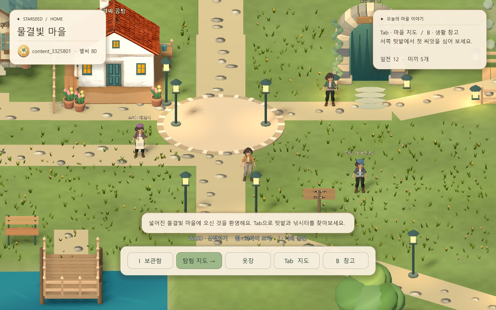
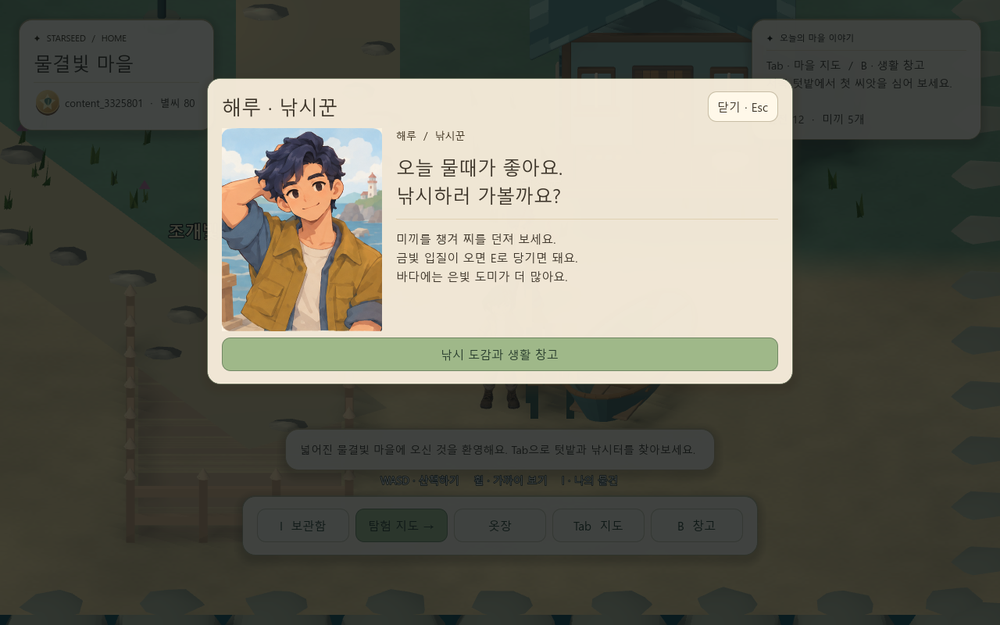
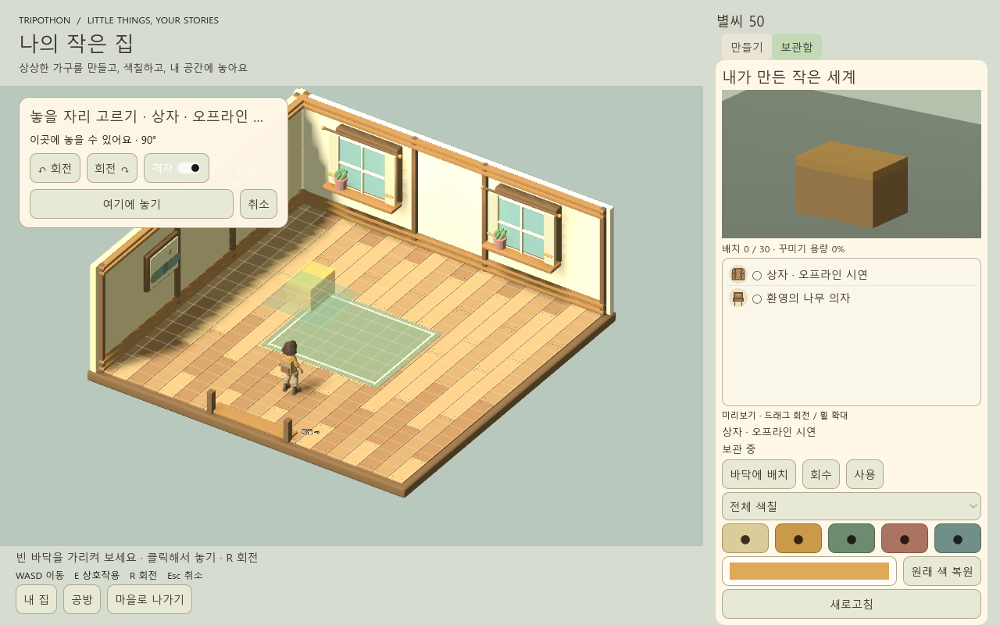
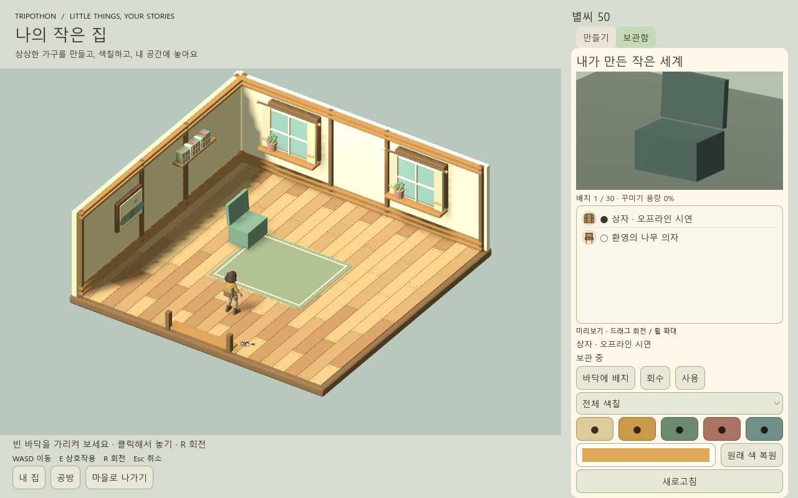
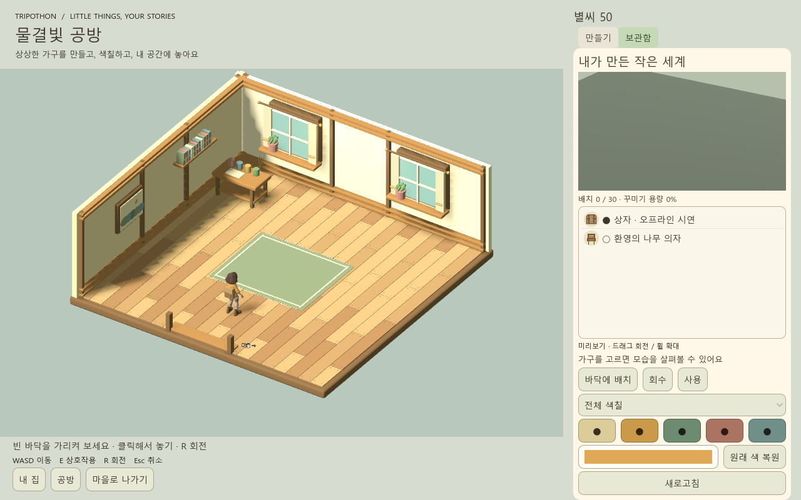

# 0.9.1 기준본 — 계획 1단계

2026-10-02의 수정본을 검증하고 같은 소스·아트·통신 규약으로 저장했다. 이 단계는 이후 콘텐츠 개선의 비교 기준을 만드는 단계이며 2~8단계의 품질 확정을 대신하지 않는다.

## 버전과 구성

| 대상 | 기준 |
|---|---|
| 클라이언트 | 0.9.1 / Windows 파일·제품 버전 0.9.1.0 |
| 엔진 | Godot 4.7.2, Compatibility / OpenGL |
| 서버 | FastAPI + 비공개 SQLite·GLB 저장소, protocol 6 |
| 서버 도구 | Python 3.13, 의존성은 `server/requirements.txt` |
| 개발 아트 | Blender 4.5.3, 편집 원본 `art/source/` |
| 온라인 데모 | HTTPS, 초대 가입, 유료 LLM·Tripo 생성 비활성 |
| 로컬 데모 | 127.0.0.1, 격리 DB에서 무료 샘플 생성 |

서버 소스와 운영 구성은 이번 단계에서 바꾸지 않았다. 온라인 확인은 Godot HTTP 클라이언트로 `/health`를 읽어 live·protocol 6을 확인한 것이다. 신규 온라인 계정을 만들거나 원격 저장소에 쓰는 종단 검사를 이번 단계에서 추가 수행하지 않았다.

## 변경 범위

- 카메라: 보간된 주시점 + 고정 오프셋. 이동 시작·방향 전환·정지 중 각도 변화 검사 추가.
- 캐릭터: 컨셉 기반 해루 메시·원래 스킨 리그와 자체 대기·걷기·낚시·인사. 대화 후 낚시 복귀. 다른 NPC의 체형 통일과 역할 소품.
- 공간: 집·공방 목재 실내, 출발 아치, 낚싯대·보트, 건물 주변 충돌·나무 간격.
- UI: 종이색과 올리브색, 생활 물건 아이콘, 자연어 안내, 플레이어의 코드·모델·부품 맞춤·기록 숨김. 로그인 화면의 숨긴 서버 주소 입력도 씬에 소속시켜 종료 시 렌더 리소스를 해제.
- 배치: 0.5 격자·회전·유효/무효 표시, 문 앞 배치 거부, 이동 중 원래 물건 숨김, 취소하면 원래 물건 복원. 번역한 부품 이름과 서버 식별자를 분리해 색칠 대상을 유지.
- 빌드: 플레이어·개발자 실행본 모두 0.9.1. 테스트 실행기에 개발용 PCK 선택을 추가. 버전별 패키지와 SHA-256 명세 생성.

핵심 변경 파일: `game/scripts/main.gd`, `player.gd`, `studio.gd`, `town.gd`, `village_life.gd`, `villager_accessories.gd`, `game/shaders/portal.gdshader`, `game/project.godot`, `game/export_presets.cfg`. 아트 제작 코드는 `tools/build_haeru.py`, `build_cozy_kit.py`이고 검증 코드는 `game/tests/content_patch.gd`, `studio_mode_review.gd`, `tools/test.ps1`이다.

## 실행

배포 폴더 `builds/Tripothon_Baseline_091` 또는 ZIP을 푼 폴더에서:

| 실행 파일 | 동작 |
|---|---|
| `Tripothon.exe` | 플레이어용. HTTPS 데모에 연결, 가입 시 초대 코드 필요 |
| `Play.cmd` | 무료 로컬 서버 + 플레이어용. Python/Godot 별도 설치 불필요 |
| `Play_Developer.cmd` | 무료 로컬 서버 + 개발용. F3와 공방 개발 탭 사용 |
| `StopServer.cmd` | 이 패키지가 시작한 로컬 서버 종료 |

온라인 계정과 로컬 계정은 별개다. 로컬 저장소는 `%LOCALAPPDATA%\TripothonDemo\server-data`다. 두 빌드는 같은 서버 규칙을 사용한다. 개발 화면은 서버 권한을 부여하지 않으며, 플레이어 PCK에 `--developer`를 붙여도 개발 화면이 나타나지 않는다.

WASD 이동, Shift 달리기, E 상호작용, Tab 지도, B 생활 창고, I 가방·제작, Space 공격, Q 먹기, F 모닥불, H 붕대. 집·공방 입구에서 E로 들어가고 가구 배치 중 R로 회전, Esc로 취소한다.

팀원이 소스에서 재현할 때 Python 3.13·uv·Godot 4.7.2와 Windows export template을 준비한다. `.tools/`는 Git에 넣지 않는다. 이 저장소의 도구 경로는 Godot 실행 파일 `.tools/godot/Godot_v4.7.2-stable_win64_console.exe`, 템플릿 `.tools/godot-templates/windows_release_x86_64.exe`다.

```powershell
.\tools\setup.ps1
.\tools\run_server.ps1
# 별도 창에서 game/project.godot 실행 또는 아래처럼 빌드
.\tools\build_game.ps1
.tools\server-venv\Scripts\python.exe tools/package_baseline.py
```

공개 `.blend`에는 해루 텍스처를 내장했다. 게임 실행·배포는 저장된 GLB를 사용하므로 유료 재생성이 필요 없다. `build_haeru.py`로 원 생성부터 다시 제작하는 과정은 비공개 개발 입력 GLB가 필요하며, 그것을 복제한 저장소의 실행 전제 조건으로 삼지 않는다.

## 검증 결과와 재현

| 검사 | 결과·범위 |
|---|---|
| 서버 단위 검사 | 128개 통과. Starlette/httpx deprecation warning 1개 |
| 현재 소스 콘텐츠 검사 | 카메라 실제 입력, 5 NPC, 해루 41개 뼈대·4동작, 실내 진입, 가구 생성·부품 색칠·회전·문 앞 거부·이동 취소·사용·회수·방별 저장 통과 |
| 현재 플레이어 PCK 콘텐츠 검사 | 같은 콘텐츠 검사 통과, 유료 제공사 호출 0회 |
| 공방 상태 동기화 | 의상·소유 물건·방 상태 동기화 통과 |
| 플레이어/개발자 PCK 화면 검사 | 공방 탭 각각 2개/5개. 플레이어 PCK의 `--developer` 우회 거부 |
| PCK + 설치 없는 서버 | 가입·보호 GLB·색칠·배치·생존 행동·저장/재개·재로그인·한 번만 차감 통과 |
| 온라인 HTTPS | Godot HTTP 클라이언트로 live·protocol 6 확인 |
| 기존 7일 플레이 근거 | 이번 콘텐츠 수정본에서 실제 422.074초, 체력 100, 58별씨, 중복 보상 거부. 기준본 저장 때 다시 7분 전체를 반복하지 않았고 이후 변경은 카메라·색칠 표시 및 배포 검증 |
| 기존 마을 생활 근거 | 물리 이동으로 농사·실시간 성장·강/바다 낚시·가게·과수원·재로그인 통과 |

```powershell
.\tools\test.ps1 -ClientScript content_patch -Capture
.\tools\test.ps1 -Packaged -ClientScript content_patch -Capture -SkipServerTests
.\tools\test.ps1 -ClientScript studio_sync -SkipServerTests
.\tools\test.ps1 -Packaged -PortableServer -Capture -SkipServerTests
.\tools\test.ps1 -Packaged -ClientScript studio_mode_review -Capture -SkipServerTests
.\tools\test.ps1 -Packaged -Developer -ClientScript studio_mode_review -Capture -SkipServerTests
# 7분 검사 전체를 다시 실행하려면
.\tools\test.ps1 -FullRun -Capture -SkipServerTests
```

격리 테스트 서버는 8766 포트와 매번 새 `artifacts/qa-*` 데이터 폴더를 사용한다. `-Capture`는 실제 렌더링을 켜며 `SCRIPT ERROR`·`ERROR` 또는 비정상 종료를 실패로 처리한다. 이번 소스·PCK 렌더링 검사는 종료 시 RID 누수 오류 없이 통과했다. 테스트 중 아트 확인 위치 이동은 물리 탐색 검사와 구별한다.

원 로그는 로컬 `artifacts/qa-stage1-*.log`, 이전 실제 플레이 로그는 `qa-seven-days-content.log`, `qa-village-content-final.log`에 있다. 이 문서는 요약이며 개인 테스트 데이터와 원 로그를 Git에 배포하지 않는다.

## 실제 캡처와 동작







[해루의 대기·걷기·낚시·인사 10초 영상](media/haeru-motion-review.mp4). Tripo에서 뼈대를 생성한 뒤 Blender에서 직접 만든 동작이며 Tripo 프리셋 애니메이션 영상이 아니다. [아트 명세](../art/haeru-manifest.json)에서 출처와 길이를 확인한다.

## 비용과 남은 한계

해루 개발 아트: P2-20260801 이미지→3D 120 + Tripo v1.0-20240301 리깅 25 = **145 Tripo 크레딧**. 승인된 5,000 한도 내의 기존 사용분이다. 기준본 검증·빌드는 추가 유료 API를 호출하지 않았다. Scenario 추가 사용도 없다. 게임 별씨와 제공사 크레딧은 다른 단위다.

해루는 개별 손가락·얼굴 뼈대가 없는 41본 리그다. 기존 주인공 hand-v4와 구분해야 하며 전 캐릭터의 고급 얼굴/손 리깅이 완료됐다는 뜻이 아니다. 온라인 유료 생성은 꺼져 있고 이번 온라인 검사는 읽기 전용이다. UV 브러시 색칠, 실시간 멀티플레이, 거래 공개 운영, 운영 DB 이전은 이 단계에 포함하지 않는다.

배포물에는 공용 GLB·런타임과 무료 샘플 서버만 포함한다. 알려진 키 일치·비밀 경로·개인 DB·ZIP 무결성 검사를 통과한 파일만 전달한다. 공개 게임 에셋을 클라이언트에 포함하는 것은 정상이며, 개인 생성물의 소유권과 경제 행위는 서버가 판정한다.

[실행본별 SHA-256](baseline091-builds.json). Windows ZIP: 299,964,916바이트, 165파일, SHA-256 `ef9197c041a765f9742a2c08ce22f4cbfa4c8f852bfeb7714085b1b55555d0ca`. 배포 검사는 문제 0건이며 API 키 값은 검사 결과에 출력하지 않는다.

완료 기준: 두 실행본의 기능 노출과 저장 규약이 확인되고, 팀원이 같은 소스·공용 아트를 복제하여 실행·검증할 수 있다. 다음은 **2단계 조작·카메라·캐릭터 비율 확정**이며 이번 단계에서 그 작업을 완료 처리하지 않았다.
