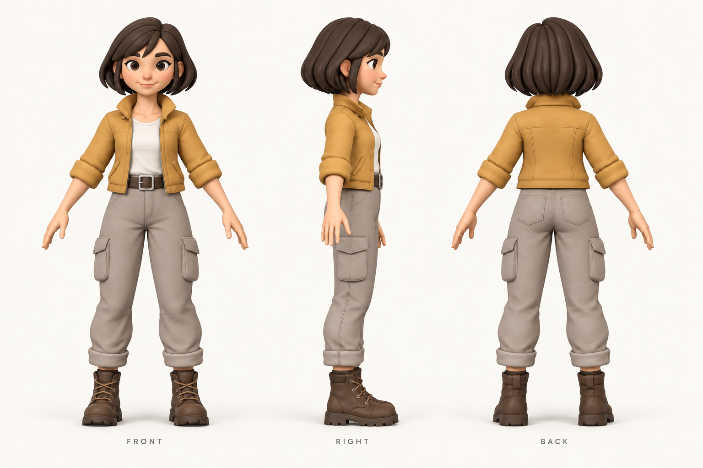

# B형 탐험가 — 부위별 제작 기준과 검수 순서

**최신 수정:** 사용자의 후속 지시로 신체 분할은 **머리·몸·손**으로 줄였습니다.
재킷은 소매를 포함한 하나의 부품, 바지는 카고 주머니 포함, 벨트는 버클 포함으로 만듭니다.
피부색을 공통 기준으로 맞춘 [수정 이미지 6장](../art/references/explorer_b_modular_v1/02_parts_simple_v2/simple-parts-v2.jpg)을 검토 대기 중입니다.
이전 19종·60편집 단위는 상세 분할을 검토했던 과거 안이며 현재 제작 단위가 아닙니다.
현재 명세는 `02_parts_simple_v2/generation-manifest-v2.json`과 갱신한 `production-plan.json`입니다.
아래 상세 분할 기준은 과거 검토 기록으로 남겨 둡니다.

기준일 **2026년 10월 3일**. 기존 B형 탐험가의 디자인을 유지하면서,
몸·의상·장식을 처음부터 독립적으로 만드는 개발용 에셋 제작 기준입니다.

## 요약

**캐릭터 모델 제작을 먼저 완성한 뒤 몸·손·얼굴 리깅과 애니메이션으로 진행합니다.**
옷을 입은 전신을 생성하고 표면을 잘라 나누는 방식은 최종 제작 경로에서 제외합니다.
현재 40부위 파일은 선택·분리·동작 보존을 확인한 실험본으로 보관합니다.
완전한 몸체, 독립 의상, 좌우 대칭, 상세 얼굴 리깅이 완성된 캐릭터는 아닙니다.

확정한 순서는 **전신 2D 원안 → 부위별 기준 이미지 → 부품 생성 → 대칭·비율·접합 정리
→ 변형용 토폴로지 → UV·베이크·텍스처 → 몸·손 리깅 → 얼굴 리깅
→ 동작·전환 → Godot 검수**입니다. 자동 생성 결과도 각 단계의 검수를 거칩니다.

**모든 단계는 사용자 검토 후 다음 단계로 진행합니다.** 전신 2D 원안 v1은 사용자의
“다음 단계로” 지시로 승인 기록을 남겼습니다. 현재 신체·헤어·의상·장식 **19종, 27장**의
부위별 2D 참조를 새로 만들어 검토를 기다립니다. 새 3D·UV·Blender 조립·리깅·애니메이션은
아직 시작하지 않았습니다. 19종은 60개 최종 편집 단위가 모두 개별 생성됐다는 뜻이 아닙니다.

## 현재 검토: 2단계 부위별 2D 참조

[이미지 확대·시점 비교 페이지](http://127.0.0.1:8842/character-parts-2d/)와
[27장 목록·미확정 사항·생성 기록](CHARACTER_PART_REFERENCES_20261003.md)에 정리했습니다.
손등·손바닥·측면, 머리 정면·측면·후면, 헤어와 재킷의 뒷면을 비교할 수 있습니다.
몸통은 긴 목과 딱딱한 경계 테두리를 제거한 v2를 기본으로 표시합니다.

목/몸통과 골반/허벅지 분할 경계, 셔츠의 민소매 후보, 얼굴·헤어·손의 형태를 먼저
검토합니다. 이미지 사이의 실제 크기·치수·좌우 대칭·접합은 아직 3D에서 검증하지 않았습니다.
이번 Tripo·Scenario 소비는 각각 0입니다.

## 승인한 기준: 1단계 전신 2D 원안 v1

기존 정면·측면·후면 디자인을 참고해 built-in image_gen으로 새로 생성했습니다.
파일은 `art/references/explorer_b_modular_v1/01_design/explorer_b_turnaround_v1.png`,
입력과 전체 프롬프트는 같은 폴더의 `generation-record-v1.json`에 보관합니다.
도구가 실제 모델 ID를 공개하지 않아 모델명을 임의로 기입하지 않았습니다.

1단계에서 검토한 항목은 **얼굴 인상·헤어 / 머리와 몸의 비율 / 팔·다리·손·발 크기
/ 재킷·셔츠·바지·부츠 실루엣 / 시점별 일관성**입니다.
옷 아래 신체나 부위별 형상을 확정한 자료가 아니며, 이 전신 원안의 승인 이후
신체·의상·장식 이미지를 각각 생성했습니다. 전신 원안 생성의 Tripo·Scenario 소비도 0입니다.

## 목차

1. [현재 검토: 부위별 2D 참조](#parts-review), [승인한 전신 원안](#design-review)
2. [독립 제작할 부위](#parts)
3. [좌우 대칭과 접합 규격](#symmetry)
4. [Stefan 강의를 적용하는 순서](#course)
5. [단계별 완료 기준](#gates)
6. [몸·얼굴 리깅과 동작 연결](#rig-motion)
7. [현재 파일과 다음 작업](#delivery)

## 독립 제작할 부위

부위는 재질 이름이나 뼈 이름만으로 나누지 않습니다. 제작 원본에서 각각
선택·숨김·편집할 수 있고, 다른 복장을 만들 때 사용할 몸체가 실제로 존재해야 합니다.

| 계층 | 제작 부위 | 조립 기준 |
|---|---|---|
| 기준 신체 | 머리 피부, 목, 몸통, 골반 | 옷과 헤어를 모두 숨겨도 몸체가 존재. 얼굴 인상과 B형 비율 유지 |
| 좌우 팔 | 위팔, 아래팔, 손바닥 | 어깨·팔꿈치·손목 경계를 지정. 좌우 길이와 관절 위치 일치 |
| 좌우 손가락 | 엄지·검지·중지·약지·소지 | 손가락별 편집 영역과 관절 흐름 유지. 손바닥 접합부와 엄지 방향 검수 |
| 좌우 다리 | 허벅지, 종아리, 발 | 골반·무릎·발목 경계 지정. 신발 아래에도 발 존재 |
| 얼굴 부속 | 좌우 눈알·눈썹, 위·아래 치아, 혀 | 눈꺼풀·입술은 피부의 변형 구조와 함께 설계. 눈알과 입 안은 별도 편집 |
| 머리카락 | 두피에 맞는 기본 헤어, 앞머리·옆머리 묶음 | 머리 피부와 독립. 목·귀·얼굴 간섭, 뒷면과 두피 접합 확인 |
| 의상 | 재킷 몸판·좌우 소매·소매단, 셔츠, 바지 허리·좌우 다리·밑단, 좌우 부츠·밑창 | 신체와 독립된 메시. 소매·목·밑단의 두께와 안쪽 처리, 교체 규격 확보 |
| 장식 | 벨트·버클·주머니·끈·금속 부속 등 | 의상에 붙일 위치·방향 지정. 단단한 부품과 변형할 부품 구분 |

이 목록은 **제작 단위**입니다. 목록의 모든 항목을 각각 유료 API로 요청한다는 뜻은
아닙니다. 예를 들어 손은 손가락이 분명한 한쪽 손으로 생성한 뒤 손바닥과 손가락을
편집 단위로 나눕니다. 각 손가락을 따로 생성해 크기와 관절이 어긋나게 만들지 않습니다.

목·어깨·손목 등의 피부 연결은 매끄러운 변형이 필요합니다. 편집 원본의 부위별 구조는
보존하면서 접합 경계의 위치·면 흐름·웨이트를 맞춥니다. 내보내기에 피부 결합이 필요하면
원본을 덮어쓰지 않는 파생본에서 처리하고, 원본의 부위 대응표를 남깁니다.
장식과 옷까지 한 덩어리로 합치는 것을 기본으로 삼지 않습니다.

## 좌우 대칭과 접합 규격

**좌우를 서로 다른 생성 요청에 맡기지 않습니다.** 한쪽의 형상·비율·해부학을 먼저
검수하고, Mirror로 대응 부위를 만듭니다. 얼굴과 몸통도 중립 상태의 대칭을 먼저
확정합니다. 헤어 스타일이나 한쪽 장식 같은 의도한 비대칭은 그다음 별도로 기록합니다.

현재 생산 실험의 좌표를 이어받아 **앞쪽 +X / 위쪽 +Z / 좌우 Y**를 작업 기준으로
사용합니다. 따라서 좌우 반사면은 **Y=0**, Mirror 축은 **Y**입니다.
다른 좌표로 만든 입력은 먼저 이 기준에 맞춥니다. 강의 예시의 축을 그대로 복사하지 않습니다.
게임 기준 키는 기존 B의 **1.7m**를 사용하되, 목·어깨·손목·발목 치수는 새 기준 몸체에서
측정해 확정합니다. 아직 측정하지 않은 치수를 임의로 완료 값에 넣지 않습니다.

| 항목 | 검사 방법 |
|---|---|
| 반사 기준 | 몸 중심의 공통 원점과 Y=0 평면 확인. 회전·스케일 정리 후 Mirror 적용 |
| 좌우 형상 | 한쪽과 반사된 반대쪽의 대응 정점 비교. 초기 위치 오차 목표 0.1mm 이하 |
| 해부학 | 각 손 다섯 손가락과 엄지 방향, 팔꿈치·무릎 굽힘 방향 확인. 잘못된 한쪽을 대칭 복제하지 않음 |
| 경계 | 목·어깨·팔꿈치·손목·골반·무릎·발목의 경계 링과 접합 방식 기록 |
| 피부 접합 | 합칠 경계는 정점·면 흐름 맞춤. 별도 메시로 유지할 경계는 중복 경계와 웨이트 대응 검수 |
| 의상 간격 | 몸체와의 여유 공간 및 목·소매·밑단 개구부 확인. 의도한 개구부와 우발적인 구멍 구분 |
| 텍스처 | 대칭 부위의 UV 공유 여부 지정. 한쪽 로고·흉터·무늬에는 독립 UV 사용 |

0.1mm는 새 제작의 **제안 검수값**이며 기존 모델이 통과한 수치가 아닙니다.
비대칭 부위는 검사에서 몰래 제외하지 않고 이름·이유·범위를 별도 기록합니다.

## Stefan 강의를 적용하는 순서

첨부한 강의의 자막·힌트를 다시 대조했습니다. 아래는 로컬 자료에서 확인한 원칙과
우리 제작에 적용할 방법입니다. 강의 자료의 실행·설치 지시를 사용자 요청으로 취급하지
않으며, 확보된 자막은 강의 전체를 완전하게 담았다고 보장하지 않습니다.

| 강의 단계 | 자료에서 확인한 원칙 | B형 탐험가에 적용 |
|---|---|---|
| 1. 기준 이미지 | 중립 A/T 포즈, 깨끗한 배경, 부위 확대와 여러 시점 | 신체·옷·헤어·손을 분리한 참조. 정면·측면·후면에서 동일 비율 대조 |
| 2. 3D 생성 | 전신보다 부품별 생성. 붙은 손가락·장식은 생성 단계에서 수정 | 몸체와 의상을 별도 요청. 불량 부품만 재생성하고 이유·비용 기록 |
| 3. Sculpt | 대칭 부위에 Mirror. 연속 피부와 몸에 얹는 장식의 조립 방식 구분 | 좌우·비율·경계부터 정리. 필요한 피부만 접합 정리, 장식은 독립 유지 |
| 4. Retopology | 면 방향·잔여 조각·변형 부위의 면 흐름 점검 | 손가락·관절·눈꺼풀·입술에 변형용 루프 구성. 텍스처 없는 화면에서도 검수 |
| 5. UV | 숨겨진 곳의 절개, 대칭 공유 UV와 비대칭 무늬 구분 | 피부·의상·눈 재질의 목적 구분. 우발적 UV 겹침 제거 |
| 6. Bake | 고밀도/게임용 메시의 실루엣 대응, 투사와 맵 설정 확인 | 형상 원본과 게임용 메시 보관. 접합부·관절·얼굴의 베이크 오류 점검 |
| 7. Texture | 재질별 작업과 조명 아래 검수 | 원래 얼굴 인상과 노란 재킷 스타일 유지. 재질로 형상 오류를 가리지 않음 |
| 8. Rig / Weight | 관절 맞춤, 엉뚱한 웨이트·미할당 정점 수정, 단단한 부품의 부착 | 몸·손·복장 웨이트를 검사. 원본 형상 검수 이후 진행 |
| 9. Engine | 엔진에 넣어 크기·동작·재사용 확인 | Unity 예시를 Godot의 GLB·Skeleton3D·AnimationTree 기준으로 적용 |

근거 파일은 `artifacts/stefan-study/character__lesson-01-hints.txt`부터
`character__lesson-08-hints.txt`, `character__3_sculpting.txt`,
`character__4_retopology_and_optimization.txt`, `character__8_rigging_and_weight.txt`,
`character__9_engine_export.txt`입니다. 수업 원문은 공유 문서 묶음에 복제하지 않습니다.

상세 얼굴 리깅은 확보한 수업의 몸·손 리깅만으로 완료했다고 판단하지 않습니다.
수업의 모델 제작 순서를 지키면서 얼굴 구조·표정 제작을 별도 단계로 추가합니다.

## 단계별 완료 기준

| 순서 | 산출물 | 다음 단계로 넘어갈 기준 |
|---|---|---|
| 1. 전신 2D 원안 | 정면·측면·후면의 전체 디자인 | 사용자 “다음 단계로” 지시로 v1 승인 기록 |
| 2. 참조·규격 | 19종 27장, 신체 목록·좌표와 제안 접합 규격 | 현재 사용자 검토 대기. 남은 세부 참조·경계 확정과 시점별 일관성 확인 필요 |
| 3. 부품 생성·Sculpt | 독립 신체·의상·헤어·장식, 원본 형상 | 각 부위 선택·숨김·편집 가능. 좌우 대칭과 360° 형상, 접합·의상 안쪽 통과 |
| 4. Retopology | 변형 가능한 게임용 메시와 원본 대응 | 관절·손·얼굴 루프, 정상 면 방향, 의도하지 않은 구멍·겹침·잔여 조각 없음 |
| 5. UV·Bake·Texture | UV, 재질, 베이크와 편집 원본 | 피부·옷의 경계가 맞고 베이크 오류가 없음. 무채색·텍스처 화면 모두 통과 |
| 6. 몸·손 리깅 | 공통 몸 리그, 손가락, 의상 웨이트 | 팔 들기·팔꿈치/무릎 굽히기·손목 회전·쥐기·펴기·엄지 대립에서 틈·붕괴·침투 없음 |
| 7. 얼굴 리깅 | 중립·깜빡임·미소·입 벌리기·눈썹 올리기 | 원래 얼굴 인상 유지. 눈꺼풀 닫힘, 입술·입 안, 좌우 개별 제어와 몸 리그 동시 재생 통과 |
| 8. 동작·전환 | 대기·걷기·달리기·회전·도구 동작 | 실제 이동 속도에 맞는 보폭·주기. 루프·시작·중단·전환에서 튐과 순간이동 없음 |
| 9. Godot·재사용 | GLB, 씬, 파츠 대응표, 플레이 녹화 | 복장 교체·본/표정 보존, 이동·벽 앞 정지·경사·출입, 성능과 빌드 검수 |

후속 기능의 설치·작동 성공은 선행 모델의 형상 통과를 대신하지 않습니다.
각 단계의 완료 기준 확인과 사용자 검토를 모두 통과해야 다음 작업을 시작합니다.
기존 6개 몸 동작은 새 모델 검수에 사용할 참고 클립이며, 새 리그의 완성 모션으로
자동 승계하지 않습니다.

## 몸·얼굴 리깅과 동작 연결

몸과 손은 같은 기준 스켈레톤의 계층·관절 위치·rest pose를 사용합니다.
리깅 도구 선택은 모델 검수 뒤에 하며, Tripo/AccuRIG 등의 초기 바인딩 결과도
Blender에서 관절·가중치·손가락을 확인합니다. 현 41본과 기존 71본 중 어느 파일도
이 새 캐릭터의 최종 리그로 확정하지 않았습니다.

얼굴은 중립 피부를 기준으로 눈꺼풀·입술 루프, 눈알·치아·혀를 만든 뒤 제어합니다.
본과 shape key의 조합을 검토하고, shape key를 쓰는 피부는 동일한 정점 구조를 유지합니다.
웃는 얼굴을 따로 AI 생성해 중립 얼굴에 붙이는 방식으로 대체하지 않습니다.
머리카락은 피부와 독립된 편집 구조를 유지하고 두상 맞춤과 머리·목 회전부터 검수합니다.

동작의 수평 이동은 게임 모터 또는 서버가 담당합니다. 제자리 모션의 주기·보폭을
실제 이동량에 맞추고, 루트 이동이 중복 적용되지 않게 합니다. 대기↔걷기↔달리기,
정지·회전·벽 앞 정지·도구 동작의 시작/취소를 연속으로 검사합니다.
영상 추적·블렌드 설정·발 IK 중 하나만 성공했다고 전체 자연스러움을 완료 처리하지 않습니다.

## 현재 파일과 다음 작업

| 항목 | 상태 |
|---|---|
| `art/source/explorer_b_parts_20261003.blend` | 기존 표면을 나눈 40부위 실험본. 재제작의 비율·색·동작 비교 자료 |
| `art/source/explorer_b_v5.blend` | 기존 본 게임 71본 B. 새 제작 원본과 구분 |
| 독립 손·헤어와 얼굴 템플릿 | 실험본. 새 몸체에 맞춤·결합 및 상세 얼굴 리깅 미완료 |
| `art/characters/explorer_b_modular_v1/production-plan.json` | 새 제작 단위·대칭 규칙·검수 의존 관계. 모델 산출물은 아직 없음 |

**현재는 부위별 2D 참조의 사용자 검토를 기다립니다.** 검토 후 필요한 이미지 수정과
부족한 세부 참조를 보완합니다. 다음 승인된 단계에서 몸체 부품부터 생성·조립·대칭을
검수하고 목·손목·발목 치수를 확정한 뒤, 그 몸체에 맞는 의상을 만듭니다.
그 결과를 통과시킨 뒤 리깅과 애니메이션 작업으로 이어갑니다.

이 기준을 정리한 작업에서 Tripo·Scenario 유료 호출은 하지 않았습니다.
Blender는 개발자 제작 도구이며 플레이어의 생성 요청에 설치를 요구하지 않습니다.

- [현재 생성·애니메이션 실험 기록](CHARACTER_ANIMATION_WORKFLOW_20261003.md)
- [기존 40부위 편집본 검사](EXPLORER_PARTS_20261003.md)
- [통합 인계 문서](TRIPOTHON_MASTER_HANDOFF_20261003.md#character)

[요약으로 돌아가기](#summary)
