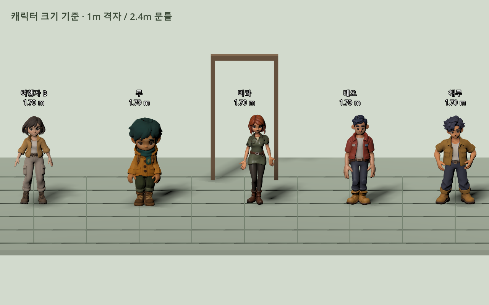

# 0.9.2 — 계획 2단계: 조작·카메라·캐릭터 비율 기준

2026-10-03 KST. 0.9.1 기준본에서 입력 상태·이동·캐릭터 표현·시점을 연결했다. 서버의 생존 규칙과 DB 스키마는 변경하지 않았으며 유료 API 호출은 없다.

## 기준값과 행동

| 항목 | 기준 |
|---|---|
| 마을 산책 / 달리기 | 2.8 / 4.5 m/s |
| 실내 산책 | 2.8 m/s |
| 생존 이동 | 서버 판정 4.5 / 6.75 m/s, 얼음·기력 조건도 서버가 판정 |
| 캐릭터 크기 | 공개 에셋 5종의 정적 메시 높이 약 1.70m |
| 주인공 몸 충돌 | 반경 0.32m, 높이 1.50m |
| 공간 검토 기준 | 1m 격자, 검토용 문틀 높이 2.4m |
| 카메라 | 직교 투영, 기본 크기 14.5 / 휠 범위 12~26 |
| 고정 시점 | 주시점 오프셋 (0, 1, -0.55), 카메라 오프셋 (0, 8.8, 16.5), 하향 약 28.1° |

`game/scripts/controller_profile.gd`에서 공통 값을 관리한다. 기존 주인공 B의 얼굴·손·메시와 체형을 유지하고, 캐릭터·NPC·실내 이동·가구 충돌의 크기 기준을 정리했다. 이것은 다른 캐릭터를 모두 B와 같은 아트 스타일로 다시 제작한 작업이 아니다. 높이 측정은 정적 메시 AABB이며 팔을 벌린 원본의 너비를 실제 서 있는 몸통 너비로 해석하지 않는다.

## 입력과 카메라

가방·대화·텍스트 입력·가구 배치 중 마을 이동을 잠근다. 생존 가방에서도 이동·반복 공격 입력을 보내지 않지만 생존 시간은 계속 흐르므로 Esc 일시 정지와 구별한다. 제작·먹기 등 가방의 명시적인 버튼은 사용할 수 있다. 대화·가방을 닫으면 이동을 다시 허용한다. 실내의 TextEdit·LineEdit에 글을 쓰면 E·R 등이 사용/회전 행동으로 전달되지 않는다.

걷기·달리기는 정규화한 입력을 사용하고 실제 수평 변위를 기준으로 표현한다. 벽 앞에서 키를 누르더라도 변위가 없으면 대기로 돌아온다. 생존 클라이언트는 서버 좌표를 표시하며 로컬 CharacterBody의 충돌이 그 좌표를 다시 밀어내지 않는다.

회전과 추적은 `1 - exp(-response * delta)` 보간을 사용한다. 카메라 위치는 한 주시점과 고정 오프셋에서 계산해 시작·정지·방향 전환에도 각도를 유지한다. 휠 입력은 목표 크기를 바꾸고 카메라가 부드럽게 접근한다. 장면 전환 시 이전 공간의 주시점을 끌고 오지 않는다.

## 발 접지와 기존 리그

주인공 B의 71본 리그와 개별 손가락 회전 보정은 유지했다. 새로운 `locomotion_pose.gd`는 걷기·달리기 중 허벅지·종아리·발에 두 관절 IK를 적용한다. 지면에 닿은 발은 월드 접점에 유지하고, 반대 발은 속도에 맞춘 보폭·주기로 들어 옮긴다. 급회전·높이 변화·순간 위치 이동으로 오래된 접점에 닿을 수 없으면 접점을 해제한다. 실제 속도가 높으면 달리기 클립을 고르고 기본 클립의 재생 속도도 보행 주기에 맞춘다. 얼굴·손가락·메시·UV·스킨 가중치를 새로 만들거나 수정하지 않는다.

보정은 B 리그를 쓰는 주인공/NPC의 보행에 적용된다. 해루와 나머지 41본 캐릭터는 기존 동작을 사용한다. IK 검사는 평지에서의 발목 접지 목표 기준이며 모든 경사·계단·발바닥 회전의 완전한 접지를 보장하는 결과가 아니다. 물리 지면 레이캐스트와 경사 발바닥 정렬은 추가 보완 범위다.

개발용 F3에는 속도·시야 크기·입력 허용 상태·보행 주기·접지 오차가 표시된다. 플레이어 빌드에는 이 진단 정보가 없다.

## 검증

| 검사 | 결과 |
|---|---|
| 렌더링된 컨트롤러 검사 | 산책 2.8000m/s, 대각선 달리기 4.5000m/s, 정지/벽 앞 대기, 가방/대화/생존 일시 정지 입력 잠금 통과 |
| 주인공 접지 목표 | 안정화 이후 평지 최대 수평 오차: 산책 0.0305m, 대각선 달리기 0.0291m. 허용 기준 각각 4cm/6cm 통과 |
| 카메라 | 고정 각도, 부드러운 확대, 같은 정지 목표에 대한 30/60/144fps 추적 결과 오차 0.1mm 미만 |
| 공개 캐릭터 크기 | B 1.6992m, 루 1.7000m, 미라 1.7000m, 테오 1.7000m, 해루 1.6992m |
| 플레이어 PCK | 컨트롤러 및 콘텐츠 검사 통과, 가구·색칠·회전·취소·회수·재접속 복원 확인 |
| 개발용 PCK | 동일 컨트롤러 검사와 F3 이동·접지 진단 표시 검사 |
| 소스 플레이 | 농사 실제 성장·낚시·가게·과수원·교량/언덕 이동·재로그인 통과 |
| PCK + 설치 없는 서버 | 가입·보호 에셋·배치·색칠·생존 행동·저장/재개·재접속·한 번만 차감 검사 |

실제 7일 전체 완주 근거는 [0.9.1 기록](BASELINE_091.md)의 422.074초 검사다. 이번 변경에서는 서버의 이동·생존·보상 규칙을 바꾸지 않았고 7분 전체를 반복하지 않았다. 컨트롤러 검사에서 미술 확인용 위치 이동은 물리 이동 검사와 구분한다.

```powershell
.\tools\test.ps1 -ClientScript controller_acceptance -Capture -SkipServerTests
.\tools\test.ps1 -ClientScript character_scale_review -Capture -SkipServerTests
.\tools\test.ps1 -Village -Capture -SkipServerTests
.\tools\build_game.ps1
.\tools\test.ps1 -Packaged -ClientScript controller_acceptance -Capture -SkipServerTests
.\tools\test.ps1 -Packaged -ClientScript content_patch -Capture -SkipServerTests
.\tools\test.ps1 -Packaged -PortableServer -Capture -SkipServerTests
```

원 로그는 로컬 `artifacts/qa-stage2-*.log`에 있다. 게임 0.9.2, Godot 4.7.2, 서버 protocol 6, 서버 DB·API와 공급자 설정은 0.9.1과 동일하다.



[실제 입력으로 산책·달리기·정지를 촬영한 검토 영상](media/controller-motion-092.mp4). 194개 연속 렌더 캡처를 30fps로 조립한 동작 검토 자료이며 성능 벤치마크가 아니다.

## 실행·변경 파일

현재 폴더 `builds/Tripothon_Baseline_092`: `Play.cmd` 무료 로컬 플레이어용, `Play_Developer.cmd` 무료 로컬 개발용, `Tripothon.exe` 직접 실행은 초대형 온라인 데모다. 이전 091 폴더를 덮어쓰지 않는다.

[실행본별 SHA-256](baseline092-builds.json). ZIP 299,979,989바이트·165파일, SHA-256 `5ac50dad9937368733e700240ffc5fd8d4289fdb3a00c7cef093c1a76e328e0c`. 알려진 키·개인 DB·비밀 경로·ZIP 무결성 검사 문제 0건.

변경: `main.gd`, `player.gd`, `studio.gd`, 새 `controller_profile.gd`·`locomotion_pose.gd`, 프로젝트/내보내기 버전. 검증: `controller_acceptance.gd`, `character_scale_review.gd`, `controller_motion_review.gd`. 공개 모델 GLB·기존 Blender 원본은 변경하지 않았다.

다음 계획은 3단계 **마을 대표 구역 완성도 개선**이다. 이번 단계에서 새 마을 전체·새 건물군·스토리 지역·생활 콘텐츠를 완료 처리하지 않는다.
