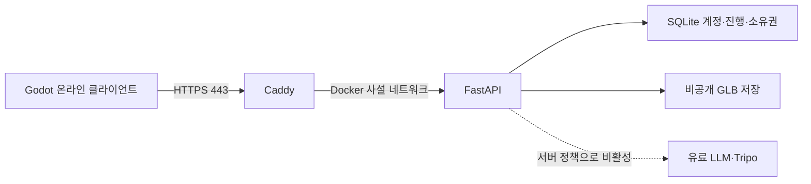

# 온라인 서버 확인 — 2026-10-03 KST

Google Cloud 콘솔의 실행 중인 VM 상세 페이지와 HTTPS 상태 응답을 읽어 확인했다. 서버 설정·과금 계정·데이터는 변경하지 않았다.

| 항목 | 확인된 구성 |
|---|---|
| 관리 화면 | [Tripothon VM 상세](https://console.cloud.google.com/compute/instancesDetail/zones/us-central1-a/instances/tripothon-demo?project=praxis-dolphin-467814-i6) |
| 서비스 | Google Cloud Compute Engine |
| VM | `tripothon-demo`, 실행 중 |
| 위치 | `us-central1-a`, 미국 중부 |
| 머신 | `e2-micro`, 표시 vCPU 2개, 메모리 1GB |
| OS | Debian 12 Bookworm, x86_64 |
| 저장 장치 | 30GB 표준 영구 디스크, 부팅 디스크 |
| 공인 주소 | `34.28.65.113`, 임시 외부 IPv4 |
| 게임 HTTPS | [서버 상태](https://34-28-65-113.sslip.io/health) |
| 상태 응답 | `ok=true`, `mode=live`, `protocol=6`, `studio_tripo_enabled=false` |
| 서버/DB | Docker의 Caddy + FastAPI 단일 작업자 + 비공개 SQLite/GLB 볼륨 |

e2-micro는 CPU를 공유하는 소형 VM이다. 표시되는 2 vCPU의 지속 CPU 할당은 합계 0.25 vCPU 상당이며 짧은 버스트를 제공한다. [Google의 E2 사양](https://docs.cloud.google.com/compute/docs/general-purpose-machines#shared-core_vms). GPU와 로컬 3D 생성 프로그램을 실행하는 서버가 아니라 계정·진행·소유권·재화·API 요청을 관리하는 데모 서버다. 동시 접속 수의 성능 보장은 아직 부하 시험으로 측정하지 않았다.

SQLite는 VM의 디스크에 있는 Docker 볼륨으로 유지된다. 이전 배포 검사에서 API 컨테이너 재시작 후 계정 지속성을 확인했다. 이번 확인은 상태 읽기만 수행했으며 DB 내부를 새로 열거나 온라인 플레이 계정을 만들지는 않았다. VM 상세에는 Google Cloud 관리형 백업 일정이 구성되지 않은 것으로 표시된다. 또한 VM 삭제 시 부팅 디스크도 삭제하는 설정이므로 컨테이너 재시작 시 보존과 VM 삭제 시 보존을 구별해야 한다. 애플리케이션 백업 절차는 [운영 문서](../ops/README.md)에 있다.

콘솔에서 무료 체험 상태를 확인했다. 잔여 일수·크레딧은 계정 소유자의 콘솔에서 확인하며 공개 Git에는 계정의 청구 정보를 저장하지 않는다. 이번 작업으로 유료 계정 활성화나 업그레이드를 수행하지 않았다.

`sslip.io` 주소는 공인 IP에 연결된 데모용 DNS다. 임시 IP가 바뀌면 온라인 게임의 주소도 갱신해야 한다. 2026-10-03에 열어 본 플레이어·개발용 두 창은 `--local-demo`로 실행되어 같은 PC의 무료 샘플 서버를 사용했다. 온라인 접속은 해당 인자 없이 `Tripothon.exe`를 직접 실행한다. 두 환경의 계정과 DB는 서로 별개다.
