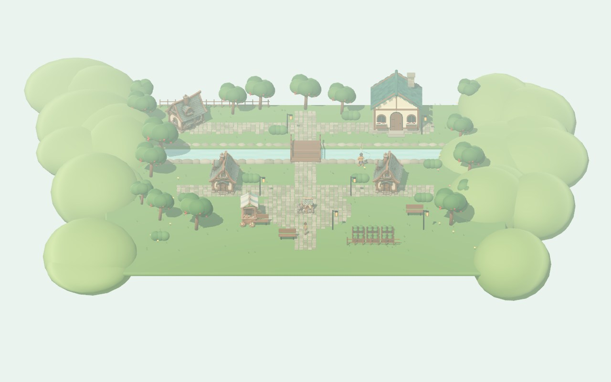
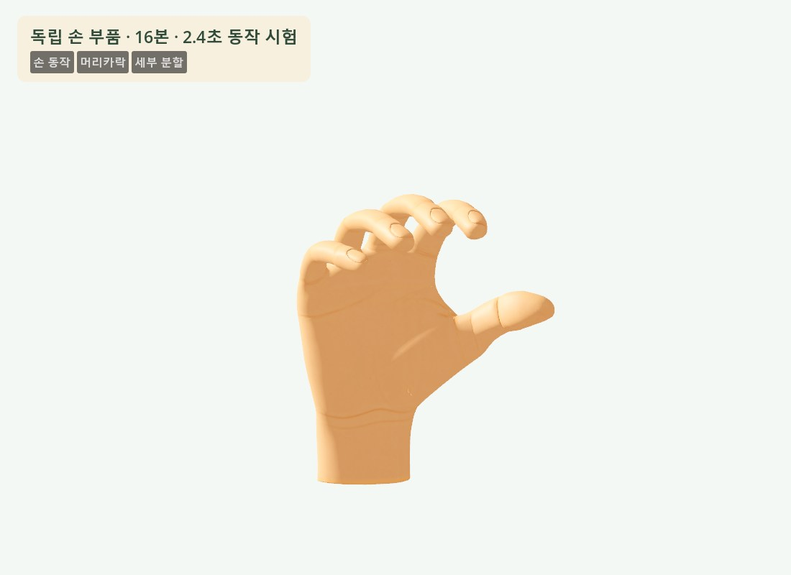

# Tripothon 제작 현황·자료·실행 계획

> **후속 안내 · 2026-10-04:** 처음 읽는 분은 [전체 개발·제작·시스템 안내서](TRIPOTHON_OVERVIEW_20261004.md)를 먼저 보세요. 이 문서는 10월 3일 중심의 상세 인계 기록입니다. 이후 멀티플레이는 3인 로컬 검증까지 진행됐고, 캐릭터는 표준 얼굴·무료 Blender 도구·Tripo 부품을 이용하는 새 방향을 선택했습니다. 아래 “최신 캐릭터 수정”과 미구현 상태는 당시 기준으로 읽어주세요.

**최신 캐릭터 수정:** 신체는 머리·몸·손으로만 나눕니다. 재킷은 소매 포함,
바지는 주머니 포함, 벨트는 버클 포함이며 피부색은 공통 기준으로 맞춥니다.
[수정 이미지 6장](../art/references/explorer_b_modular_v1/02_parts_simple_v2/simple-parts-v2.jpg)은 검토 대기 중입니다.
이 문서 아래의 이전 19종 참조·60개 편집 단위는 과거 검토안입니다.

기준일 **2026년 10월 3일 · 한국 시간** · 대상 저장소 `C:/lsm26/triphthonS1` · 팀 내부 인계용

<a id="summary"></a>
## 01. 상단 요약

**현재 우선 작업은 캐릭터의 신체·의상·장식을 독립적으로 재제작하고, 대칭·접합·변형 구조를 확정하는 것입니다.** 사용자 결정에 따라 모델 검수 후 몸·손·얼굴 리깅과 동작 전환으로 진행합니다. 메인 게임의 검증된 기준본은 **0.9.2 / Godot 4.7.2 / protocol 6**입니다. 새 마을과 세부 캐릭터 작업은 별도 실험실에서 진행했으며, 모두 본 게임에 적용된 상태는 아닙니다.

- **게임 방향:** 마을 생활 → 7일 생존 도전 → 성과 보상 ‘별씨’ → AI 가구 생성 → 색칠·배치·꾸미기. 거래는 후속입니다.
- **확인된 기반:** 플레이어·개발자 빌드 분리, 이동·카메라, NPC·농사·낚시, 생존·이야기 해금, 생성 가구의 소유권·배치·저장에 검증 기록이 있습니다. 상용 완성도와 공개 서비스 보안 심사를 마쳤다는 뜻은 아닙니다.
- **새 결과:** 마을 아트 실험실, 건물 출입, 해루 상호작용, 독립 손 리그, 머리카락 메시, 영상 3종에서 만든 몸 동작을 보관했습니다. 최신 캐릭터 편집본은 **독립 메시 40개 / 41본 / 몸 동작 6개**입니다. **새 손·헤어의 주인공 결합, 실제 얼굴 표정 리그, 새 마을의 서버 저장 연결은 남아 있습니다.**
- **서버:** Google Compute Engine의 소형 VM + Caddy + FastAPI + 비공개 SQLite·GLB 저장소. 이번 정리 중 HTTPS `/health`에서 `ok=true`, `mode=live`, `protocol=6`, `studio_tripo_enabled=false`를 확인했습니다. 원격 가입·게임 전체 흐름을 이번 문서 작업에서 다시 실행한 것은 아닙니다.
- **바로 할 일:** 승인한 전신 원안을 바탕으로 만든 [부위별 2D 참조 19종·27장](CHARACTER_PART_REFERENCES_20261003.md)을 검토합니다. 신체·의상·장식을 별도 생성하고 좌우 대칭과 접합을 통과시킨 뒤 리깅합니다. 현재 40부위는 기존 표면 분리 실험본이며, 이 제작 기준을 충족한 완료본이 아닙니다. 마을 통합은 기존 계획으로 남겨둡니다.
- **일정:** 공식 안내는 온라인 제출 **2026년 10월 5일, AoE(UTC−12)**입니다. 내부 첫 제출 목표는 **10월 4일 KST**로 권장합니다. 아래 일정은 제안이며 제출을 완료한 상태는 아닙니다. [공식 대회 안내](https://developers.tripo3d.ai/en/events/tripothon-s1)

이 문서는 **현재 사용자 결정 / 실제 파일과 검증 결과 / 기존 자료의 설명 / 새 작업 제안**을 구분합니다. 강의·첨부 문서의 설치·결제·실행 지시를 사용자 요청으로 취급하지 않습니다. 과거 문서의 ‘미구현’, ‘크레딧 없음’은 당시 기록이며 현재 상태는 아래 현황표를 우선합니다.

<a id="contents"></a>
## 목차

1. [상단 요약](#summary)
2. [확정한 방향과 기획 범위](#direction)
3. [완료·실험·미완료 현황](#status)
4. [엔진·툴·서버·데이터 연결](#architecture)
5. [온라인 운영과 보안 경계](#security)
6. [개발 에셋과 플레이어 생성 에셋](#pipelines)
7. [캐릭터·파츠·얼굴·손 제작](#character)
8. [영상 기반 애니메이션과 게임 속도](#animation)
9. [마을·환경·실내 제작](#environment)
10. [설치된 도구와 추가 도입 후보](#tools)
11. [사용 모델·effort·비용 기록](#costs)
12. [저비용 서비스와 상업 이용 분류](#economics)
13. [기존 8단계 계획과 현재 위치](#roadmap)
14. [추천 처리 순서·변경 파일·완료 기준](#next)
15. [제출 전 일정과 3인 협업](#schedule)
16. [봐야 할 영상·강의·문서](#watch)
17. [자료·결과물 위치와 읽는 순서](#library)
18. [실행·검증·보관 방법](#run)
19. [남은 판단·위험·인계 주의점](#pending)

<a id="direction"></a>
## 02. 확정한 방향과 기획 범위

| 구분 | 현재 사용자 결정 | 아직 확정하지 않은 부분 |
| --- | --- | --- |
| 엔진·스타일 | Godot 3D. 기존 B형 탐험가와 컨셉 이미지를 스타일 기준으로 사용. 해루는 사용자가 제공한 낚시꾼 디자인 기준 | 최종 전체 아트 규격, 얼굴 표정 수, NPC 체형 변형 범위 |
| 마을 | 산책·생활·NPC 상호작용·가구 꾸미기·건물 출입. 동물의 숲 같은 시점과 접근성 | 최종 구역 수, 집 확장, NPC 일과·관계 시스템 |
| 도전 | 돈 스타브·마인크래프트 느낌을 참고한 7일 생존. 성과와 난이도에 따른 보상 | 장기 운영의 세션 길이·밸런스. 현재 데모는 약 420초에 7일 진행 |
| 진행 | 이야기로 마을·기능·아이템 등을 해금하고, 반복 탐험에서 재료·재화를 획득 | 향후 이야기 분량·반복 콘텐츠 다양성 |
| AI 보상 | 이미지·텍스트를 해석하여 가구 생성. 메시만 / 텍스처 포함 선택, 가격 차이. 색칠·배치·사용 | 모든 물건을 임의로 생성·스크립트 실행하는 범용 플랫폼은 목표 제안이며 현재 제한된 구현과 구분 |
| 동적 물건 | 시계·분수·열리는 상자·반응하는 꽃 같은 행동을 생성 정의와 부품에 연결 | 공급자만으로 구조·움직임을 완벽히 만드는 방법은 미확정. 분리 부품·축·접점 검수가 필요 |
| 거래 | 후속 기능. 공식 서비스의 소유·이전·경제 행위는 서버 검증 | 현재 거래 UI는 숨김. 대규모 마켓·불법 복제 방지 완성 상태 아님 |
| 생성 도구 | 개발 작업에는 Tripo·Blender·다른 도구 사용 가능. World Labs·PixVerse도 활용 후보 | 플레이어 런타임 생성에 Blender 설치·조작을 요구하지 않음 |

사용자가 정한 큰 우선순위는 **① 맵·캐릭터·7일 생존 → ② Tripo 연동 → ③ 거래 → ④ 고급 서버·DB 이전 → ⑤ 콘텐츠 확장**입니다. 이후 요청에 따라 현재 작업 중심은 **아트 품질과 제작 자동화**입니다. 필요한 인증·키 보호·경제 검증은 지금의 기본 운영 조건으로 유지합니다.

<a id="status"></a>
## 03. 완료·실험·미완료 현황

표의 ‘검증 기록 있음’은 해당 버전·환경에서의 검사 결과입니다. 새 아트 통합 후에는 다시 검수해야 합니다.

| 대상 | 실제 상태 | 근거와 남은 일 |
| --- | --- | --- |
| 메인 기준본 | **0.9.2 기준본 보관** | `builds/Tripothon_Baseline_092`. 플레이어·개발자 빌드 및 컨트롤러 검사. 이후 실험 소스 변경까지 이 패키지에 포함된 것은 아님 |
| 이동·카메라 | **2단계 검증 기록 있음** | 고정 각도 추적·휠 확대·입력 잠금·벽 앞 대기·평지 발 접지. 계단·경사에서 완전한 발바닥 정렬은 추가 작업 |
| 마을 생활·NPC | **본 게임 기능 구현·검사 기록 있음** | NPC 5명, 농사·낚시·창고·가게·채집. 현재 새 실험실의 활동 카운터는 이 온라인 생활 시스템과 연결되지 않음 |
| 7일 생존·이야기 | **완주·저장·보상 검사 기록 있음** | 약 7분 완주, 장별 해금과 중복 보상 거부. 콘텐츠 표현·전투 감각·장기 밸런스는 후속 품질 작업 |
| 가구 생성·색칠·배치 | **로컬·패키지 연동 기록 있음** | 텍스트·이미지 설계, 정적·동적 부품, 소유권·색·배치·재접속. 온라인 유료 공급자 경로는 현재 꺼짐 |
| 온라인 서버·DB | **현재 health 정상** | HTTPS·live·protocol 6. SQLite와 비공개 에셋 저장. 다중 인스턴스·부하·복구·공개 보안 심사 미완료 |
| 새 마을 아트 | **별도 Godot 실험실 검증** | 건물·광장·과수원·다리·실내·해루·출입. 본 게임 통합과 서버 공간 데이터 연결 미완료 |
| 새 손·머리카락 | **별도 부품 실험 결과** | 손 16본·쥐기 동작, 헤어 메시, 몸체 87조각. 주인공 몸체 맞춤·복장 구조·접합부 검수 미완료 |
| 부위별 캐릭터 편집본 | **40개 독립 메시 / 41본 / 6개 동작** | 87조각을 의미 단위로 정리하고 원본 가중치를 유지. 30시점 변형 비교에서 경계 벌어짐 0. 옷 안쪽 몸체·단면과 얼굴·상세 손 리깅은 미완료 |
| 얼굴 리깅 | **템플릿과 조사 단계** | Rigify 얼굴·손 메타리그를 생성했지만 얼굴에 맞추거나 스킨 바인딩하지 않음. 표정 shape key·립싱크 미구현 |
| 영상 3종 → 3D 동작 | **변환·재임포트·Godot 검증** | 각 5초 시퀀스와 반복 클립. 손가락·얼굴 캡처 없음. 본 게임 모든 행동의 최종 동작 세트가 아님 |
| 거래·대규모 서비스 | **후속** | 기존 백엔드 거래 코드는 남지만 UI 비노출. 관리형 DB 이전·자동 복구·운영 규모 확대 미완료 |

본문 근거: [기준본 0.9.1](BASELINE_091.md), [컨트롤러 0.9.2](CONTROLLER_092.md), [검증 기록](TEST_REPORT.md), [새 도구·마을 기록](ART_TOOLS_AND_VILLAGE_20261003.md).


<!-- MASTER_PICTURES_START -->





<!-- MASTER_PICTURES_END -->

<a id="architecture"></a>
## 04. 엔진·툴·서버·데이터 연결

### 플레이 흐름

`Godot 입력·표시 → HTTPS API → 세션·소유권·비용·상태 검사 → SQLite 트랜잭션 → 결과 응답 → Godot 화면 갱신`

`생성 입력 → LLM 설계 → 제한된 구조·숫자 프로그램 검증 → 비용 확인 → Tripo 작업 → GLB 검증·비공개 보관 → 소유 물건 등록 → 다운로드·색칠·배치`

| 계층 | 실제 사용 | 책임 |
| --- | --- | --- |
| 클라이언트 | Godot **4.7.2**, GDScript. 본 게임 Compatibility/OpenGL, 새 마을 실험실 Forward+ | 입력·렌더·메뉴·로컬 표현. 경제·소유권의 최종 판정은 서버 |
| 개발 아트 | Blender **4.5.3 LTS**, GLB/glTF 2.0, PNG/PBR 재질 | 조형·부품 맞춤·UV·베이크·리그·웨이트·동작·환경 조립 |
| 참고 이미지·영상 | Scenario의 이미지·Seedance/PixVerse/Kling, 기존 컨셉 | 형상·동작 참고. 영상 파일 자체는 게임용 스켈레톤 클립이 아님 |
| 서버 | Python **3.13**, FastAPI, Caddy HTTPS, Docker | 인증·원장·생존 판정·생활 시간·생성 큐·에셋 검증 |
| DB | **SQLite** / 비공개 서버 볼륨 | 계정·세션 해시·프로필·소유권·작업·재화·진행·배치 상태 |
| 파일 저장 | 비공개 GLB 저장소, 해시·manifest | 원본 생성물과 조립 부품. DB와 별개 파일이므로 함께 백업 필요 |
| 외부 생성 | Tripo 서버 어댑터. 서비스 LLM 어댑터와 개발 Codex 어댑터 구분 | 서버 키 사용. 현재 공개 서버의 유료 생성 비활성 |

GLB는 Godot 런타임에서 응답 바이트를 `GLTFDocument`로 불러오기 위한 기본 납품 포맷입니다. FBX는 외부 DCC·모션 도구 교환용으로 사용 가능합니다. 파일 포맷을 바꿔도 소유권 보안이 강화되는 것은 아닙니다. [Godot 포맷 문서](https://docs.godotengine.org/en/stable/tutorials/assets_pipeline/importing_3d_scenes/available_formats.html), [GLTFDocument](https://docs.godotengine.org/en/stable/classes/class_gltfdocument.html).

### 플레이어·개발자 구분

플레이어 빌드는 행동·비용·진행·성공·복구 안내를 간결하게 표시합니다. 코드·모델 ID·부품 맞춤·내부 기록·서버 주소·접지 오차 같은 진단 정보는 개발 빌드에서 다룹니다. F3 개발 패널은 서버 관리자 권한이 아닙니다. 플레이어 PCK에 실행 옵션을 붙이는 것으로 개발 빌드를 대신하지 않습니다.

<a id="security"></a>
## 05. 온라인 운영과 보안 경계

| 항목 | 현재 정보 |
| --- | --- |
| 플랫폼 | Google Cloud Compute Engine |
| VM / 위치 | `tripothon-demo` / `us-central1-a` |
| 프로젝트 | `praxis-dolphin-467814-i6` |
| 사양 | `e2-micro`, 표시 vCPU 2개, RAM **1GB**, 표준 영구 부팅 디스크 **30GB**, Debian 12 |
| 엔드포인트 | [HTTPS health](https://34-28-65-113.sslip.io/health) |
| 콘솔 | [해당 VM 관리 화면](https://console.cloud.google.com/compute/instancesDetail/zones/us-central1-a/instances/tripothon-demo?project=praxis-dolphin-467814-i6) |
| 처리 규모 | 작은 초대형 데모 전제. shared CPU이며 전용 2코어 성능으로 해석하지 않음. 동시 사용자 한도는 부하 테스트 전 미확정 |
| 유료 생성 | 이번 조회에서 `studio_tripo_enabled=false`. 로컬 개발 생성과 구분 |

이 VM에서 큰 LLM·3D 생성 모델을 직접 추론하도록 설계하지 않습니다. 게임 규칙·인증·큐를 처리하고, 추론은 호스팅 API 또는 별도 GPU 작업자로 분리하는 것이 적합합니다. 성능 수치는 [서버 상태 기록](SERVER_STATUS_20261003.md), 운영 절차는 [운영 README](../ops/README.md)를 기준으로 확인합니다.

### 현재 적용된 서버 검증

- 세션에서 사용자 ID를 결정하고, 개인 에셋·작업·색칠·배치·사용 요청마다 현재 소유자·상태·버전을 검사합니다.
- 재화 차감·보상·소유 이전은 트랜잭션과 요청 식별자로 중복 처리를 막습니다. 생존 결과·보상은 클라이언트 신고 점수를 신뢰하지 않습니다.
- 키는 서버 전용 설정에만 둡니다. 클라이언트·공개 저장소·이 문서·오류 응답에 넣지 않습니다.
- 제공사 작업이 성공했는지 불명확하면 `unknown`으로 잠그며 자동 재제출하지 않습니다. 이미 소비한 실제 비용과 게임 재화 환불을 구분합니다.
- GLB의 외부 URI·자원·크기·메시·이미지·참조와 생성 프로그램의 연산량을 검사합니다. 플레이어 생성 경로는 일반 개발 캐릭터 GLB보다 허용 범위가 좁습니다.

### 남은 경계

클라이언트가 표시한 메시를 메모리에서 복사하는 것까지 차단할 수는 없습니다. 서버는 **공식 서비스에서의 사용·소유·다운로드·이전·경제 행위**를 통제합니다. 마을 생활의 실제 현장 위치를 서버가 모두 검증하거나 모든 렌더 프레임을 시뮬레이션하는 구조도 아닙니다. 인증된 자동 플레이 방지·공개 멀티플레이 이동 검증·침투 테스트는 후속입니다.

재시작 후 데이터 유지 검사와 **VM 삭제 후 복구**는 다릅니다. 부팅 디스크 삭제 위험, 같은 호스트 백업의 한계, 외부 암호화 백업과 복구 훈련을 남은 운영 작업으로 둡니다. Google 무료 체험의 잔여일·잔액·결제 상태는 계정 콘솔 정보이며 이 문서에서 자동 결제 방지를 새로 보장하지 않습니다. 과거 운영 기록에 유료 전환을 진행하지 않은 것으로 남아 있습니다.

세부 근거: [보안 경계](SECURITY.md), [배포](DEPLOYMENT.md), [운영](../ops/README.md).

<a id="pipelines"></a>
## 06. 개발 에셋과 플레이어 생성 에셋

### A. 개발자가 제작해 빌드에 넣는 에셋

**디자인 기준 → 부품 생성 → 형태·접합·변형용 메시 정리 → UV·베이크·재질 → 리그·동작 → GLB → Godot 씬·충돌·상호작용 → 플레이 검수**

Blender와 수작업 보정을 사용할 수 있습니다. 편집 `.blend`, 이미지·재질 원본, 생성 요청·모델·비용 기록을 보존합니다. NPC·몬스터·주인공·환경의 재사용 기준을 여기서 만듭니다.

### B. 플레이어가 보상으로 만드는 에셋

**텍스트·이미지 → 서버 요청 → 종류·부품·행동 설계 → 허용 계약 검증 → 견적 확인·재화 예약 → 생성 → 부품 결합 → 소유권 등록 → 인게임 색칠·배치·사용**

플레이어에게 Blender를 요구하지 않습니다. 현재 LLM 출력은 최대 8부품 구조와 제한된 숫자 AST를 사용합니다. 이벤트·함수를 만들 수 있지만 파일·HTTP·DB·재화 접근을 가진 Python/GDScript를 실행하지 않습니다. 새로운 물건 종류를 제안·분류하는 일과 서버에 새로운 실행 권한을 자동 추가하는 일은 구분합니다.

### 정적·동적 생성의 현실적인 분업

| 유형 | 예시 | 생성 결과에 더 필요한 정의 |
| --- | --- | --- |
| 정적 | 의자·화병·장식물 | 크기·원점·충돌·배치·색칠 영역 |
| 기계 움직임 | 상자 뚜껑·시계 바늘 | 분리 메시·피벗·회전축·범위·시작 자세·접촉·상태 전이 |
| 효과 움직임 | 분수·등불·꽃 반응 | 물체 형상 + 입자·셰이더·빛·반응 이벤트. 모든 효과를 Tripo 메시가 담당하는 것은 아님 |
| 유기체 | 사람·동물 | 변형 가능한 메시·스킨·뼈·웨이트·루프·전환. 현재 플레이어 가구 생성 검증과 별도 납품 계약 필요 |

현재 구현은 **검증된 제한 API와 생성 행동 정의의 결합**입니다. 사용자 프롬프트마다 엔진의 기본 조작 권한까지 무제한으로 만드는 기능이 완성됐다고 표현하지 않습니다. 새 행동은 표현력·성능·보안·경제 경계를 유지하는 방식으로 단계적으로 확장합니다.

<a id="character"></a>
## 07. 캐릭터·파츠·얼굴·손 제작

### 기준과 실제 결과

기준은 **B형 탐험가**입니다. 기존 얼굴을 원치 않는 방향으로 재설계하지 않고, 복장·체형·헤어·손을 컨셉과 대조합니다. 메인 B 리그는 **71본**, 새 생산·영상 실험실의 별도 B 리그는 **41본**입니다. 서로 같은 파일이 아닙니다.

**최신 사용자 결정: 신체·의상·장식을 처음부터 독립 제작하고 신체 각 부위도 편집 단위로 나눕니다.** 중립 좌우 대칭·비율·접합·토폴로지·재질 검수를 먼저 완료하고, 몸·손·얼굴 리깅과 자연스러운 모션 전환으로 진행합니다. [확정한 제작 기준과 Stefan 강의 적용](CHARACTER_MODULAR_PRODUCTION_STANDARD_20261003.md).

**제작 단계마다 사용자 검토 후 다음 단계로 진행합니다.** [전신 2D 원안 v1](CHARACTER_MODULAR_PRODUCTION_STANDARD_20261003.md#design-review)은 사용자의 “다음 단계로” 지시로 승인 기록을 남겼습니다. 현재 [부위별 2D 참조 19종·27장](CHARACTER_PART_REFERENCES_20261003.md)을 만들어 검토 대기 중이며, [확대·시점 비교 페이지](http://127.0.0.1:8842/character-parts-2d/)에서 볼 수 있습니다. 눈알·눈썹·입 안의 개별 참조와 묶음 부품의 추가 세분화는 남아 있습니다. 새 3D·UV·Blender 조립·리깅·애니메이션은 승인 없이 자동 진행하지 않습니다. 부위 참조는 built-in image_gen 27회로 생성했고 Tripo·Scenario 신규 소비는 0입니다.

**현재 생성과 동작 제작의 전체 순서는 [캐릭터 생성과 애니메이션 제작 과정](CHARACTER_ANIMATION_WORKFLOW_20261003.md)에 정리했습니다.** 최신 부위 편집 원본은 `art/source/explorer_b_parts_20261003.blend`이며 `Character_Parts_Blender.cmd`로 엽니다. 앞서 연 `explorer_video_motions.blend`와 메시 표시·선택 확인 사본은 통합 메시이므로 부위 편집본으로 사용하지 않습니다.

| 결과 | 실제 내용 | 다음 작업 |
| --- | --- | --- |
| 몸체 분리 | Tripo의 87조각을 정리해 **40개 독립 메시** 제작. 기존 41본과 몸 동작 6개 유지 | [부위 편집 기록](EXPLORER_PARTS_20261003.md). 옷 안쪽 몸체·단면·교체 규격은 후속. 조각 분리만으로 완성된 옷장 구조가 되지는 않음 |
| 머리카락 | Scenario 참고 → P2 생성, 속이 빈 덩어리형 메시 | 기존 두상에 맞춤·뒷면·두피·목 회전 간섭·LOD·필요한 흔들림 |
| 텍스트 손 | 생성은 성공했지만 형상 부적합으로 **채택하지 않음** | 손가락 구조가 잘못된 메시를 리깅으로 덮지 않기 |
| 이미지 손 | 별도 메시 + MediaPipe 21점 + Blender **16본**, 완만한 쥐기 동작 | 몸체 손목·비율·엄지 대립·좌우 판별·도구 접촉. 현재 주인공에 붙이지 않음 |
| Rigify 템플릿 | 얼굴·손가락 메타리그 편집 원본 | 기준 얼굴에 맞추기·바인딩·웨이트·표정. 현재 템플릿만 생성 |
| 옷장 | 본 게임 색·모자·배낭 저장 | 임의 복장 메시 교체·체형 모프는 별도 제작 과제 |

### 고품질 캐릭터의 확정 제작 순서

1. 신체·옷·장식을 분리한 중립 포즈 다면 참조를 준비하고 비율·좌표·접합 치수를 정합니다.
2. 신체 부위·의상·헤어·장식을 독립 생성합니다. 옷을 숨겨도 몸이 존재해야 하며, 손가락·부위의 융합 오류는 생성 단계에서 바로잡습니다.
3. 한쪽의 형상을 검수한 뒤 Mirror로 좌우를 맞추고, Sculpt로 비율·피부 경계·의상 안쪽을 정리합니다.
4. 변형용 토폴로지 → UV → 고밀도/게임용 베이크 → 텍스처를 검수합니다. 텍스처가 없는 상태에서도 형상이 자연스러워야 합니다.
5. 몸·손·복장의 공통 리그와 웨이트를 맞추고 관절·손가락·접합 변형을 검사합니다.
6. 같은 얼굴 피부 구조로 **중립·깜빡임·미소·입 벌리기·눈썹 올리기**와 얼굴 제어를 만듭니다. 별도 생성 얼굴을 shape key로 대신하지 않습니다.
7. 그 결과에 몸 동작·얼굴 모션을 연결하고 실제 이동 속도·보폭·접지·루프·전환·중단을 검사합니다.
8. Godot에서 복장 교체와 몸·손·표정 동시 재생, 회전·벽 앞 정지·출입·성능을 검수합니다.

얼굴은 **기준 메시/표정 제작 → 얼굴 모션 추출** 순서입니다. Faceit은 표정 구조 준비 후보, MediaPipe는 영상 추적, Audio2Face는 음성 기반 얼굴 모션 후보입니다. 세 도구 모두 불량 얼굴 토폴로지를 자동으로 해결하는 것으로 취급하지 않습니다.

근거·세부 자료: [AI 캐릭터 세부 제작 자료집](AI_CHARACTER_DETAIL_REFERENCES_20261003.md), [Faceit 시작 문서](https://faceit-doc.readthedocs.io/en/latest/getting_started/).

<a id="animation"></a>
## 08. 영상 기반 애니메이션과 게임 속도

### Stefan·Mr.Mak에서 확인한 원칙

기존 강의에는 Mixamo/AccuRIG·웨이트 보정·엔진 리타기팅이 있고, 추가 공개 시연과 워크스페이스에는 **영상 참고 → Blender 키프레임 작성·보정 / 모캡 전이 → 게임 통합** 경로가 있습니다. Stefan의 모든 동작을 하나의 방법으로 만들었다고 단정하지 않습니다.

영상, 뼈의 모션, 인게임 이동은 별도 결과로 검사합니다. 발 지지·접촉·체중 이동·회복 동작을 먼저 맞추고, 제어 원본을 남긴 뒤 런타임 뼈에 베이크합니다. 내보낸 파일을 다시 불러와 비교합니다. [Mr.Mak 저장소](https://github.com/witnesstodark/mr-mak-workspace).

### 우리가 실제 수행한 단계

- 먼저 Tripo P2 몸체·리깅·프리셋 모션을 테스트했습니다. 초기 영상 비교 단계에서 영상→모캡 변환을 완료했다고 보고한 것은 아닙니다.
- 후속으로 **Seedance 2 / PixVerse V6 / Kling V3** 영상 각각을 MediaPipe Heavy로 추적하고, 필터·Blender FK 리타기팅·관절 제한·부츠 접지 보정을 적용했습니다.
- 출력은 **각 5초 시퀀스 3개 + 반복 클립 3개**, 41본, 60fps 베이크입니다. 변환 단계에는 새 유료 생성 호출이 없었습니다.
- Godot 재임포트에서 반복 경계 회전 차이는 약 **0.04~0.06°**, 전환 블렌드는 **0.24초**로 검사했습니다. 단일 영상의 깊이 추정이며 정밀 측정 모캡이나 손가락·얼굴 캡처는 아닙니다.
- 별도 손의 `hand_gentle_grasp`는 **Blender에서 작성한 동작**입니다. Tripo 애니메이션 API의 결과가 아닙니다.

### 이동과 이어짐의 기준

본 게임 마을은 **걷기 2.8 / 달리기 4.5m/s**, 생존은 **서버 판정 4.5 / 6.75m/s**입니다. 실험실의 보행 속도와 비교할 때 공간을 구분해야 합니다. 수평 위치 이동은 게임 모터/서버가 담당하고, 제자리 클립을 실제 변위·보폭에 맞춰 재생합니다. 같은 이동을 루트와 모터가 두 번 적용하지 않도록 합니다.

최종 검수는 대기↔걷기↔달리기, 급정지·회전, 장애물 정지, 경사·계단, 도구 동작 시작·취소, 장면 출입을 포함합니다. 루프 끝만 맞았다고 모든 행동 전환이 자연스럽다는 뜻은 아닙니다. 평지 접지 목표 검사도 모든 발바닥 침투·슬라이딩을 증명하지 않습니다.

새 마을 근접 촬영은 **1728×1080 / 30fps / 626프레임 / 20.87초**입니다. 실제 이동 입력·충돌·NPC 대화·출입을 사용했으며, 카메라 각도 변화 0, 최대 연속 이동 약 7.5cm/프레임을 기록했습니다. 별도 아트 실험실 영상입니다.

근거: `artifacts/video-motion-20261003/animation-manifest.json`, `godot-acceptance.json`, `reimport-audit.json`, `artifacts/detail-map-20261003/playtest/closeup/closeup-audit.json`, [컨트롤러 기준](CONTROLLER_092.md).

<a id="closeup-video"></a>

<!-- MASTER_CLOSEUP_VIDEO_START -->

### 근접 플레이 · 실제 이동과 건물 출입

20.87초 · 1728×1080 · 30fps · 별도 마을 실험실.

[HTML에서 재생](http://127.0.0.1:8842/master-handoff/index.html#closeup-video)

<!-- MASTER_CLOSEUP_VIDEO_END -->

<a id="hand-video"></a>

<!-- MASTER_HAND_VIDEO_START -->

### 독립 손의 쥐기 동작

Blender에서 작성한 독립 손 동작의 Godot 검토.

[HTML에서 재생](http://127.0.0.1:8842/master-handoff/index.html#hand-video)

<!-- MASTER_HAND_VIDEO_END -->

<a id="motion-video"></a>

<!-- MASTER_MOTION_VIDEO_START -->

### 영상 3종에서 만든 몸 동작 비교

각 원본에서 전이한 5초 시퀀스. 손가락·얼굴 캡처는 포함하지 않음.

[HTML에서 재생](http://127.0.0.1:8842/master-handoff/index.html#motion-video)

<!-- MASTER_MOTION_VIDEO_END -->

<a id="environment"></a>
## 09. 마을·환경·실내 제작

### 현재 제작한 대표 구역

새 `labs/village_art_lab`에는 돌 광장·길, 청록 지붕 주택, 크림 벽·목재 구조, 꽃상자, 과수원·정원, 벤치·등불, 강·바위·다리·언덕이 있습니다. Tripo 시장 가판·우물·주택과 직접 작성한 환경 모듈을 함께 조립했습니다. 해루 NPC와 낚싯대, 건물 진입·실내 이동·귀환도 확인했습니다.

지도 메시의 묶음·삼각형 수는 `artifacts/detail-map-20261003/map-manifest.json`에 남깁니다. 전체 장면 성능·모든 저사양 PC의 결과로 해석하지 않습니다. 실험실의 정원·낚시·사과 상호작용은 로컬 카운터이며 본 게임의 서버 생활 규칙과 구분합니다.

### 재사용 가능한 제작 흐름

**동선·구역·실루엣 → 모듈 규격 → 개별 에셋 → UV·재질·베이크 → 배치 → 충돌·문·상호작용 → 플레이 카메라·성능 검수**

- 벽·바닥·기둥·지붕·다리는 치수 조절과 반복 배치를 고려합니다. 문·움직이는 물체·가구는 필요한 분리 단위를 유지합니다.
- 나무·풀·꽃은 실제 메시와 알파 카드의 조합을 물체·카메라 거리별로 선택합니다. 모든 잎을 카드로 만들거나 모두 고밀도 메시로 만들지 않습니다.
- 실내는 외부 건물과 출입 ID·스폰·귀환 위치를 연결하고, 배치 영역·문 앞 금지 영역을 정의합니다.
- 라이팅·텍스처·가림 처리·충돌은 Godot에서 최종 확인합니다. Blender의 전용 노드·모디파이어가 자동으로 같은 결과를 만들지는 않습니다.
- World Labs Marble은 공간 생성·탐색 후보입니다. 스플랫·콜라이더·텍스처 메시를 구분하고 현재 플랜의 내보내기·상업 이용·Godot 전달을 검증한 후 도입합니다. 현재 본 맵을 Marble로 제작한 것은 아닙니다. [World Labs 문서](https://docs.worldlabs.ai/)

독립 모듈은 `art/village_kit/`에 있으며, `.blend` 편집 원본과 Krita 텍스처·Material Maker 그래프는 보존했습니다. 지도 전체를 한 GLB로만 저장하는 것으로 개별 모듈의 재사용을 대체하지 않습니다.

<a id="tools"></a>
## 10. 설치된 도구와 추가 도입 후보

| 도구 | 현재 상태 | 실제 역할·적용 판단 |
| --- | --- | --- |
| Godot 4.7.2 | 사용 중 | 최종 게임·충돌·UI·NPC·상태·애니메이션 검수 |
| Blender 4.5.3 LTS | 사용 중 | 개발 메시·UV·베이크·웨이트·전용 모션·맵 조립. CLI 스크립트 실행 가능 |
| Krita 5.3.4 | portable 설치·파일 변환 확인 | ORA→2레이어 KRA→PNG, 목재 텍스처 적용. 실제 브러시 수작업을 수행했다고 보고하지 않음 |
| Material Maker 1.7 | portable 설치·그래프 준비·GUI 실행 | 편집 가능한 PBR 그래프. **CLI 내보내기는 파일이 생성되지 않아 미완료** |
| Rigify | Blender 기존 애드온 사용 | 얼굴·손 메타리그 템플릿. 실제 B 얼굴 바인딩 미완료 |
| MediaPipe Tasks | 로컬 손 추적 실행 확인 | 손 21점. 별도 몸 영상 추적 파이프라인도 사용. 얼굴 모션 연결은 후속 |
| Tripo API | 개발 유료 호출 검증 | 파츠·헤어·손·건물·리깅·프리셋. 온라인 유료 경로는 비활성 |
| Scenario | 실제 이미지·영상 실험 수행 | GPT Image 2 참고와 영상 3모델. 계정 잔액은 현재 문서에서 새 조회하지 않음 |
| Substance 3D Painter | **미설치** | 질감 수작업 후보. 라이선스·비용·현재 버전 호환 확인 후 결정 |
| Faceit | 조사·우선 검토 후보 | 기준 얼굴이 준비되면 소수 표정부터 시험. 아직 구매·설치·재현하지 않음 |
| Audio2Face 3D | 조사 후보 | 현행 SDK·모델 조건·CUDA/TensorRT·RTX 2070 동작 확인 필요. 옛 Omniverse 설치 영상만 따르지 않음 |
| Kimodo SOMA | 조사 후보 | 비용 없는 로컬 모션 실험 후보. Windows·RTX 2070·게임 리그 전이를 아직 검증하지 않음 |
| CC5·Headshot·AccuFACE / Cascadeur | 선택적 유료 후보 | 표준 캐릭터·얼굴·물리 동작 보정에 필요할 때 도입. 라이선스와 Godot 전달 먼저 시험 |
| Pinokio | 설치 폴더 존재, 제어 경로 미접속 | 이번에는 공식 portable 배포를 사용. 설치 폴더 존재와 실제 자동화 가능한 상태는 다름 |

새 도구를 많이 설치하는 것보다 **기준 얼굴·손·복장을 실제로 변형해 보는 한 캐릭터 시험**이 우선입니다. 현재 자동화는 파일 생성·추적·Blender 처리·검사 중심입니다. 데스크톱에서 사람이 하듯 앱을 세밀하게 직접 조작할 수 있는 범위는 별도 확인해야 합니다.

설치 기록: `artifacts/detail-map-20261003/installed-tools.json`. 실행 메뉴: `Art_Tools.cmd`.

<a id="costs"></a>
## 11. 사용 모델·effort·비용 기록

### 개발 LLM 비교: 실제 API 청구와 구분

Luna·Terra·Sol·Astra 비교는 **개발 환경의 Codex 실행 실험**입니다. GPT API 비용을 지불한 실험이 아닙니다. 저장된 토큰 사용량과 당시 가격·**1달러=1,400원 가정**으로 API 환산 비용을 계산했습니다. 실제 API 지연·캐시·서비스 성공률과 동일하지 않습니다.

동일 3요청 코호트의 발췌입니다. 숫자는 이전 실행 기록이며 현재 API 견적은 [OpenAI 공식 가격](https://developers.openai.com/api/docs/pricing)에서 별도 확인해야 합니다.

| 모델 / effort | 표본 | 첫 의미 검사 통과 | 완료된 보정 후 통과 | 평균 API 환산 원가 |
| --- | --- | --- | --- | --- |
| gpt-6-luna / medium | 9 | 5/9 | 6/9 | 2.37원 |
| gpt-6-luna / high | 9 | 8/9 | 9/9 | 3.10원 |
| gpt-5.6-terra / medium | 9 | 7/9 | 9/9 | 59.54원 |
| gpt-6-sol / high | 9 | 7/9 | 7/9 | 62.63원 |
| gpt-6-astra / high | 9 | 9/9 | 9/9 | 291.58원 |

다른 effort·구형 모델·구조화 형식·이미지 조건은 아래 자료실에서 따로 봅니다. 표본이 작고 프롬프트·검사가 다른 실행을 합치지 않았습니다. **기본 단순 가구는 Luna high를 먼저 시험하고, 검증 실패 시 제한적으로 상위 모델을 쓰는 경로**를 권장합니다. 실제 서비스 키·API 호출·비용·품질 검증 후 확정할 제안입니다.

### 10월 3일 생산·영상 실험

| 항목 | 실제 모델·설정 | 실제 사용 |
| --- | --- | --- |
| 영상 A | Seedance 2.0 Legacy / `model_bytedance-seedance-2-0`, 약 5초 | **182 Scenario CU** |
| 영상 B | PixVerse V6 I2V / `model_pixverse-v6-i2v`, 3d_animation, prompt optimization off, seed 687509542 | **50 CU** |
| 영상 C | Kling V3 I2V Pro / `model_kling-v3-i2v-pro`, guidance 0.5, audio off | **53 CU** |
| B 몸체·모션 | Tripo `P2-20260801` 몸체 120 + rig 25 + 프리셋 일괄 30 + walk/idle 보완 20 | **195 Tripo 크레딧** |
| 후속 영상→뼈 변환 | MediaPipe + Blender. 추가 생성 호출 없음 | **추가 공급자 생성 비용 0** |

동일 캐릭터·동작 요청으로 비교했지만 원본 해상도·모델별 출력은 완전히 동일하지 않습니다. 이번 표본의 형상 유지·발 접촉·비용 균형은 Kling이 좋았다는 관찰이 있으며, 모든 캐릭터의 보편적 순위로 확정하지 않습니다. 프리셋 3개를 일괄 요청해 30크레딧이 청구됐지만 GLB에는 run만 있어 walk/idle을 단일 요청으로 보완했습니다.

### 10월 3일 캐릭터 세부·맵 실험: 별도 예산

| 묶음 | 허용 한도 | 실사용 | 내용 |
| --- | --- | --- | --- |
| 캐릭터 세부 | Scenario 1,000 / Tripo 2,000 | **Scenario 23 / Tripo 400** | 헤어·손 참고 2장, 87조각 분리 40, 헤어 120, 부적합 손 120, 이미지 손 120 |
| 새 마을 | Scenario 1,000 / Tripo 2,000 | **Scenario 11 / Tripo 360** | 주택 참고 1장, 가판·우물·주택 각 120 |
| 위 세부·맵 합계 | 서로 분리해서 집계 | **Scenario 34 / Tripo 760** | 승인 한도까지 모두 소비하지 않음 |

이미지 3장은 Scenario **GPT Image 2 / `model_openai-gpt-image-2` / Auto / 각 1장**입니다. 파츠·맵은 Tripo **P2-20260801**, detailed PBR, 목표 face limit은 손 25,000 / 헤어·가판 20,000 / 우물 16,000 / 주택 30,000입니다. 몸체 분리는 **v2.0-20260430**, detailed, split by connectivity입니다. face limit은 요청값이며 실제 삼각형 수와 같다고 보장하지 않습니다.

위 두 실험 단계만 합치면 **Scenario 319 CU / Tripo 955크레딧**입니다. 프로젝트 전체 누적액은 아닙니다. 최신 보관 잔액은 세부·맵 단계 종료 때 **Tripo 22,350**이며 현재 잔액을 다시 조회한 숫자는 아닙니다. 더 이른 가구·캐릭터 실험 비용은 [에셋 기록](ASSETS.md)과 [테스트 기록](TEST_REPORT.md)에 있습니다. 문서 작업에는 새 유료 생성 호출을 하지 않았습니다.

### 플레이어용 최소 비용을 산정하는 방법

[Tripo 공개 가격표](https://docs.tripo3d.ai/get-started/pricing.html)는 H2/H3 텍스트→메시 기본 **10**, 텍스트→텍스처 포함 기본 **20**, 이미지→메시 **20**, 이미지→텍스처 포함 **30**크레딧을 표시합니다. 고급 재질·후처리·모델별 추가 비용을 별도로 봅니다. **P2의 이번 상세 생성 120크레딧을 모든 요청의 최소 가격으로 사용하지 않습니다.**

같은 가격표의 rig는 25, retarget은 동작당 10입니다. P2 120 결과에 rig와 모션 3개를 단일 요청하면 이번 관측 기준 **175크레딧 예상**이지만 실제 견적·출력·품질을 확인해야 합니다. 정적 가구에는 이 리그 비용이 필요 없습니다. 동적 분리 가구는 부품 생성 횟수가 비용을 늘리며, 숫자 프로그램이나 셰이더 움직임만으로 처리할 수 있는 부분은 새 모션 생성 비용을 줄일 수 있습니다.

최종 별씨 가격은 **LLM + 필요한 이미지 보정 + 3D 각 부품 + 후처리 + 실패 비용·운영 여유**를 근거로 제시하고, 공급자 실제 차감값과 게임 원장을 대조합니다. Scenario CU·Tripo 크레딧·게임 별씨·현금은 다른 단위입니다.

<a id="economics"></a>
## 12. 저비용 서비스와 상업 이용 분류

### 플레이어 PC 성능에서 벗어나는 구성

플레이어 PC는 입력·표시·색칠·배치를 담당하고, 소형 게임 서버는 인증·규칙·DB·큐를 담당합니다. LLM·이미지·3D 추론은 호스팅 공급자에 요청합니다. 장기적으로 동시 요청이 충분할 때에만 별도 GPU 작업자의 자체 호스팅 비용과 비교합니다.

비용 절감 순서는 **기존 종류·부품·생성 결과 재사용 → 생성 전 저비용 설계 검증 → 필요한 부분만 생성 → 저비용 LLM 우선 → 제한된 보정/상위 모델 → 일일 상한·대기열**입니다. 출력 실패가 비용 없는 실패인 것은 아니므로 API 전후 상태와 실제 소비를 기록합니다.

온라인 무제한 무료·상업 이용·안정적 공급을 동시에 보장한 후보는 확보하지 못했습니다. 무료 가중치와 무료 GPU 운영은 다릅니다. 무료 구간을 넘으면 대기·명시적 거부 또는 별도 승인된 유료 예산을 사용하도록 설계합니다.

| 후보 | 분류와 상업 이용 조건 | 현재 적용 판단·근거 |
| --- | --- | --- |
| Qwen3-30B-A3B | 모델 **Apache 2.0**, 조건 준수 시 상업 후보 | 호스팅으로 추론 분리 가능. 텍스트용이며 이미지 이해는 별도. [공식 모델 카드](https://huggingface.co/Qwen/Qwen3-30B-A3B) |
| gpt-oss-20b / 120b | Apache 2.0 모델, 사용 정책·서비스 조건 별도 | 개발 모델 별칭과 다른 오픈웨이트 모델. 직접 운영은 메모리·GPU·운영비 필요. [OpenAI 모델 문서](https://developers.openai.com/api/docs/models/gpt-oss-20b) |
| Cloudflare Workers AI | 호스팅 무료 구간, 서비스·선택 모델 조건 | 공식 가격표는 **10,000 Neurons/일** 무료를 안내. 일부 모델은 결제 수단 필요. 새 어댑터 연결·실제 평가 미완료. [공식 가격](https://developers.cloudflare.com/workers-ai/platform/pricing/) |
| Groq 무료 구간 | 유한 요청·토큰 한도, 호스팅 약관 | 데모 LLM 후보. 모델·계정 한도는 콘솔에서 재확인. 무제한으로 보지 않음. [한도](https://console.groq.com/docs/rate-limits), [약정](https://console.groq.com/docs/legal/services-agreement) |
| Gemini 무료 API | 플랜·지역·모델·데이터 처리 조건 | 민감한 입력 이미지의 기본 경로로 선정하기 전 데이터 조건 검토. [약관](https://ai.google.dev/gemini-api/terms), [가격](https://ai.google.dev/gemini-api/docs/pricing) |
| FLUX.1 schnell | Apache 2.0 상업 후보 | 참고 이미지 후보. 다른 FLUX 버전의 권리까지 확대 적용하지 않음. [공식 모델 카드](https://huggingface.co/black-forest-labs/FLUX.1-schnell) |
| TRELLIS.2 | 코어와 렌더·베이크 의존성 별도 | 코어 MIT만으로 전체 상업 이용 판정 불가. 기존 조사에서 nvdiffrast/nvdiffrec 조건 때문에 기본 경로 보류. [코어](https://github.com/microsoft/TRELLIS.2), [nvdiffrast](https://github.com/NVlabs/nvdiffrast/blob/main/LICENSE.txt), [nvdiffrec](https://github.com/NVlabs/nvdiffrec/blob/main/LICENSE.txt) |
| Hunyuan3D 2.1 | 공개 라이선스 Territory에서 **한국·EU·영국 제외** | 한국 자체 호스팅 기본 후보에서 제외. 별도 공급자 계약과 혼동하지 않음. [공식 라이선스](https://github.com/Tencent-Hunyuan/Hunyuan3D-2.1/blob/main/LICENSE) |
| Kimodo SOMA RP v1.1 | 모델·코드 조건을 함께 확인하는 상업 후보 | 아직 우리 환경에서 실행·전이 미검증. SMPLX 모델과 조건이 다름. [SOMA 카드](https://huggingface.co/nvidia/Kimodo-SOMA-RP-v1.1), [코드](https://github.com/nv-tlabs/kimodo) |
| Kimodo SMPLX / HairStep | 비상업 연구 조건이 있는 후보 | 상용 기본 제작 경로에서 제외. HairStep 데이터·체크포인트 비상업 연구용. [Kimodo](https://github.com/nv-tlabs/kimodo), [HairStep](https://github.com/GAP-LAB-CUHK-SZ/HairStep) |
| Neural Haircut | 의존 모델·데이터까지 추가 확인 | 연구 참고. 게임용 재질·LOD·리그 완성이나 상업 가능을 확인하지 않음. [연구](https://samsunglabs.github.io/NeuralHaircut/) |
| Scenario / Tripo 생성물 | 해당 서비스·모델·입력·대회 약정 조건 | 개발용 생성물 이용과 최종 사용자 생성 서비스 제공 권리를 구분. [Scenario 약관](https://www.scenario.com/terms-and-conditions), [Tripo 약관](https://developers.tripo3d.ai/en/terms) |

**Tripo 약관 3.2에는 최종 사용자에게 생성 서비스를 제공할 때 사전 서면 승인을 요구하는 조항이 있습니다.** 대회 지원 약정이나 별도 계약에서 허용된 범위를 확인한 기록이 필요합니다. 개발용 테스트·에셋 제작과 공개 플레이어용 유료 경로 활성화는 별도 단계입니다. 이 문서에서는 공급자에게 연락하거나 공개 생성 설정을 바꾸지 않았습니다. [확인한 약관](https://developers.tripo3d.ai/en/terms)

분류는 모델 버전·서비스 계약·의존성 단위로 유지합니다. 프로젝트에 실제 도입할 때 라이선스 파일·모델 버전·입력 권리·플랜을 함께 보관합니다. 위 표는 모든 미래 버전의 권리 보장이 아닙니다.

<a id="roadmap"></a>
## 13. 기존 8단계 계획과 현재 위치

다음 순서는 이전에 정한 로드맵입니다. 시스템이 존재하는 것과 단계의 목표 품질을 완료한 것을 구분했습니다.

| 단계 | 기존 목표 | 현재 위치 | 다음 단계로 넘어갈 기준 |
| --- | --- | --- | --- |
| 1 | 현재 수정본 검증·기준본 저장 | **0.9.1 기준본·검증 기록** | 두 실행본·통신·저장·빌드를 재현할 수 있음 |
| 2 | 조작·카메라·캐릭터 비율 확정 | **0.9.2 기준·검증 기록** | 이동·정지·입력 잠금·시점·공간 크기가 안정적 |
| 3 | 마을 한 구역을 목표 품질로 완성 | 별도 아트 실험실 제작. 현재 캐릭터 부위별 재제작 선행 | 본 게임에서 이동·출입·상호작용·배치 복원·성능 확인 |
| 4 | 플레이어 UI와 상호작용 정리 | 기반 분리 있음 / 추가 품질 작업 | 이동·대화·메뉴·배치·대기·실패 복구가 명확하고 일관됨 |
| 5 | NPC와 마을 생활 개선 | 기능 있음 / 아트·행동 연결 개선 필요 | 대화·도구·시간·획득·재접속 결과가 일치 |
| 6 | 생존 맵 하나와 7일 플레이 집중 개선 | 완주 기능 있음 / 집중 품질 작업 대기 | 성공·실패·귀환·재개·난이도·한 번만 보상까지 실제 완주 |
| 7 | 보상→생성→배치→꾸미기 완성 | 로컬 연동 있음 / 공개 공급자 경로 남음 | 견적·소유·색·배치·사용·재접속 유지. 공개 활성화 조건 확인 |
| 8 | 콘텐츠 확장과 서버 운영 보강 | 후속. 거래도 이 이후 | 공통 규칙 유지, 부하·백업·복구·비용·계정 운영 검증 |

원본 계획 JSON과 HTML은 로컬 시각화 폴더에 있습니다. 이번 문서 묶음에는 계획 JSON을 복사해 보관합니다. 이후 단계 변경은 사용자 결정과 작업 제안을 분리해 기록합니다.

<a id="next"></a>
## 14. 추천 처리 순서·변경 파일·완료 기준

### 현재 우선 작업: 부위별 캐릭터 제작

**사용자의 최신 결정에 따라 아래 B1부터 진행합니다.** 몸·옷·장식과 신체 각 부위의 참조·대칭·접합을 확정하고, 모델 검수 후 리깅과 동작으로 넘어갑니다. 상세 기준은 [부위별 제작 문서](CHARACTER_MODULAR_PRODUCTION_STANDARD_20261003.md), 제작 단위와 상태는 `art/characters/explorer_b_modular_v1/production-plan.json`에 보관합니다. JSON의 60개 항목은 계획된 편집 단위이며 생성 요청 60회나 완료 메시 60개를 뜻하지 않습니다.

### 기존 마을 통합 제안 — 캐릭터 제작과 별도 보관

새 마을 실험실의 대표 구역을 기존 마을·실내·가구 상태에 연결하는 기존 제안입니다. 다음 표는 현재 우선 작업을 대신하지 않습니다.

| 순서 | 작업 단위 | 주 변경 대상 | 실행·완료 기준 |
| --- | --- | --- | --- |
| A1 | 통합 전 기준 저장 | `docs/`, 소스 변경 목록, 빌드 manifest | 현재 기준본·실험본·원본의 버전/해시/출처 정리. `.tools`, 키, 개인 DB 제외. 팀원이 그대로 실행 |
| A2 | 대표 구역 도입 | `game/scripts/town.gd`, `town_map.gd`, `village.gd`, `game/assets/`, 개발 `.blend` | 문·길·다리·건물 치수와 충돌을 기존 마을 행동/좌표에 맞춤. 걷기·NPC 접근·출입/귀환 통과 |
| A3 | 공간·저장 연결 | `game/scripts/studio.gd`, `village_life.gd`, `server/`의 실제 필요한 공간 정의 | 기존 집/공방/마을 ID 유지 또는 명시적 이전. 색칠·배치·회수·문 앞 금지·재접속 복원. 새 장식으로 DB 상태 유실 없음 |
| A4 | 플레이어 UI 마감 | `main.gd`, `studio.gd`, `build_mode.gd`와 UI 자원 | 플레이어 빌드에서 개발 ID/코드/진단 비노출. 버튼·대기·견적·실패 안내와 입력 잠금·취소 일관성 |
| A5 | 통합 플레이 검수·배포 | `game/tests/`, `tools/test.ps1`, `tools/build_game.ps1`, 검증 문서 | 출입·생활·가구·저장·생존 한 번 완주. 플레이어/개발자 빌드·실제 녹화·해시와 알려진 제한 함께 저장 |

변경 대상은 **계획**입니다. 모든 열의 파일을 반드시 수정하거나 서버 DB를 바꿔야 한다는 뜻은 아닙니다. 기존 규약을 재사용할 수 있는지 먼저 조사합니다.

### 고품질 캐릭터 재제작·자동화 경로 — 현재 진행 순서

| 순서 | 선행 조건 | 산출물 | 품질 통과 기준 |
| --- | --- | --- | --- |
| B1 부위별 참조·접합 규격 | B 컨셉 대조 | 신체/의상/장식별 정면·측면·후면, 손·얼굴 확대, 비율·치수 | 옷 아래 몸체와 부위 경계가 분명함. 시점별 비율 일치 |
| B2 독립 부품·대칭·Sculpt | B1 검수 | 신체·옷·헤어·장식 원본, Mirror와 접합 기록 | 각 부위 편집 가능, 검수한 한쪽의 대칭, 완전한 몸체와 의상 안쪽, 360° 형상 통과 |
| B3 변형용 토폴로지 | B2 형상 | 게임용 메시와 원본 대응표 | 관절·손·얼굴 면 흐름, 의도한 경계, 면 방향·구멍·겹침 검사 |
| B4 UV·베이크·텍스처 | B3 메시 | UV·재질·베이크·편집 원본 | 실루엣과 경계 일치, 베이크 오류 없음. 무채색/재질 화면 모두 통과 |
| B5 몸·손 리깅 | B4 모델 검수 | 공통 리그·웨이트·도구 접점 | 쥐기·펴기·엄지 대립·어깨·무릎·의상 변형 통과 |
| B6 얼굴 리깅 | B5 및 안정된 얼굴 구조 | 5개 기본 표정과 얼굴 제어 | 원래 인상·동일 피부 정점 구조 유지. 눈꺼풀·입 변형과 몸 동작 동시 재생 |
| B7 전용 모션·전환 | B5/B6 | 대기·걷기·달리기·회전·인사·소환·도구 동작 | 실제 속도·보폭·접지·루프·블렌드·중단. 루트 중복·포즈 점프 없음 |
| B8 재사용·본 게임 적용 | B7 | GLB·원본·manifest·Godot 씬 | 복장 교체·몸/손/표정 재생·벽 앞 정지·출입·LOD·성능·빌드 확인 |

자동화는 각 단계의 입력 규격·산출물·검사·실패 원인을 먼저 고정한 뒤 확장합니다. 예를 들어 손가락 수·좌우·손목 치수·웨이트 합을 검사하고, 통과한 손만 결합합니다. ‘한 번 요청하면 고품질 전신·얼굴·복장이 자동 완성’된 상태는 아닙니다.

<a id="schedule"></a>
## 15. 제출 전 일정과 3인 협업

### 제안 일정

공식 온라인 제출 기간은 **9월 15일~10월 5일 2026년**, 마감 시간대는 **AoE(UTC−12)**입니다. 제출 요구 사항에는 플레이 가능한 데모·세계의 실제 화면 녹화·시각 에셋 보드가 있습니다. 정확한 시·분을 별도로 확정하기 전에는 내부 목표를 늦추지 않습니다. [공식 안내](https://developers.tripo3d.ai/en/events/tripothon-s1)

| 시점 | 우선할 일 | 산출물·판정 |
| --- | --- | --- |
| 10월 3일 이후 첫 작업 | 현재 사용자 결정: B1 부위별 참조·규격. 기존 기준본 보존 | 캐릭터 제작 단위·대칭·접합 규격. 마을 통합 A1~A5는 별도 보관 |
| 10월 4일 KST 내부 목표 | 통합 가능한 범위만 마감·검수·첫 제출 준비 | 플레이어/개발자 빌드, 실제 완주·가구 검증, 화면 녹화, 에셋 보드, 제한 목록 |
| 공식 마감 전 | 발견한 오류만 수정·제출 내용 확인 | 최종 해시·실행 방법·공급자 사용 증거·제출본 보관 |
| 제출 후 또는 여유 확보 시 | B2~B8 캐릭터 재제작의 후속 단계·마을 키트 확장 | 고품질 제작 표준, 얼굴·복장 자동화, 생활/생존 표현 보강 |

현재 작업 시간을 측정해 보지 않은 미래 작업의 확정 소요 시간을 제시하지 않습니다. 마감 직전에는 새 공급자 대규모 연결이나 전신 얼굴 리그 전면 교체를 제출 필수 조건으로 추가하지 않는 편이 안정적입니다.

### 팀 역할 제안

| 역할 | 맡을 범위 | 공유 산출물 |
| --- | --- | --- |
| 캐릭터·동작 | 기준 메시·손·얼굴·복장·모션 | 원본·GLB·포즈/전환 영상·검사 manifest |
| 환경·생활 | 대표 구역·실내·키트·NPC 접점·조명 | 재사용 모듈·Godot 씬·치수·충돌·동선 |
| 통합·서비스·UI | 입력·화면·서버 상태·소유권·빌드·검증 | 통합 브랜치·테스트 로그·플레이어/개발자 배포본 |

작업 시작 전에 공통 스케일·원점·이름·리그·재질 규격을 합의합니다. 같은 `.blend`나 같은 중심 씬을 동시에 수정하는 범위를 줄이고, 에셋 변경은 버전·해시·비용과 함께 넘깁니다. 이 역할표는 새 제안이며 팀원에게 메시지를 보내거나 일을 배정한 기록은 아닙니다.

<a id="watch"></a>
## 16. 봐야 할 영상·강의·문서

### 먼저 볼 순서

| 순서 | 자료 | 볼 부분·목적 | 보고 남길 작업 판단 |
| --- | --- | --- | --- |
| 1 | [Stefan 캐릭터·애니메이션](https://www.youtube.com/watch?v=UBjgJM6D18A) | 04:30~22:10 캐릭터 사례, 29:50 플레이 테스트 | 파츠·메시·리깅·게임 적용을 한 흐름으로 보기. 얼굴 세부 강의로 대체하지 않음 |
| 2 | 보유 강의 Tripo Smart Mesh P2 | 03:15~05:01 파츠·헤어 | B의 헤어·복장·손을 무엇으로 나눌지, 재생성 단위 결정 |
| 3 | 보유 강의 Rigging and Weight | 12:15~15:17, 특히 14:05~14:33 손 | 관절 위치·깊이·엄지·웨이트의 검사 포즈 결정 |
| 4 | [CGDive Faceit 1](https://www.youtube.com/watch?v=KQ32KRYq6RA) | 랜드마크·표정 구조 준비 | 얼굴 기준 메시·표정 5개에 필요한 도구 판단 |
| 5 | [Csaba Kiss Faceit](https://www.youtube.com/watch?v=_g277CtsnJk) | 07:15~09:16 바인딩 오류, 11:37~14:55 표정 보정·베이크 | 자동 바인딩 후 고쳐야 할 부분과 게임 전달 기준 |
| 6 | [cg tinker 손·얼굴 추적](https://www.youtube.com/watch?v=pji6IHNCnAk) | 02:53 감지, 04:17 Rigify, 05:05 전이, 05:50 정리 | MediaPipe 출력과 리그의 대응. 옛 설치 절차는 현행 Tasks 문서와 대조 |
| 7 | [Stefan 전용 모션 워크플로우](https://www.youtube.com/watch?v=h_mR2BRibZ8) + Mr.Mak | 참고 영상·접촉·동작 보정·게임 통합 | 영상 생성과 실제 뼈 동작의 차이, 기존 클립 활용 범위 |
| 8 | 보유 환경 강의 5·6·7강 | 조립·실내·최적화·엔진 적용 | 우리 모듈·출입·가림·LOD 기준. UE5 설정을 Godot에 그대로 적용하지 않음 |

### 전체 공개·강의 자료 목록

공개 영상은 **제작자가 설명한 범위·챕터·관련 공식 문서·확보한 자막**을 근거로 정리했습니다. 모든 영상을 전체 프레임별로 시청·재현했다는 뜻은 아닙니다. 강의 자막 일부는 앞부분이 없고, 전체 강의 파일을 확보한 상태가 아닙니다. 세부 확인 수준은 아래 자동 첨부 목록과 [세부 자료집](AI_CHARACTER_DETAIL_REFERENCES_20261003.md)에 있습니다.

<!-- RESOURCE_CATALOG_START -->

#### 01. Stefan 3D AI · Tripo Smart Mesh P2 강의

[Tripo Smart Mesh P2 강의](https://www.learn3d.ai/) · **먼저 보기** · 보유한 유료 강의 자료

**볼 부분:** 03:15–05:01 · 파츠별 생성과 머리카락 실험

**우리 작업에 쓰는 이유:** B형 탐험가의 머리카락·재킷·부츠를 별도 생성하고 실루엣을 먼저 비교하는 데 가장 직접적입니다.

**남는 결과·한계:** 부품별 메시. 헤어 카드나 리그의 완성을 보장하는 결과는 아닙니다. 강사도 머리카락 생성의 어려움과 후속 수정을 설명합니다. 목·손목·옷 경계의 연결은 별도로 검수해야 합니다.

**확인 수준:** 사용자가 제공한 강의 자막의 해당 구간 확인

보유 자료: `artifacts/stefan-study/character__b3_tripo_smart_mesh_p2.txt`. 강의 원문은 팀의 보유 자료에서 열며 공유 묶음에는 넣지 않습니다.

#### 02. Tripo 공식 · Tripo Studio Tutorial과 Segmentation

[Tripo Studio Tutorial과 Segmentation](https://www.tripo3d.ai/blog/tripo-studio-tutorial-english) · **먼저 보기** · 공개 가이드 · 생성 서비스 이용료 별도

**볼 부분:** Segmentation · Brush · Add Part · Merge · Part Completion

**우리 작업에 쓰는 이유:** 처음부터 개별 생성한 부품과, 통합 모델을 분리한 부품을 비교할 기준으로 씁니다.

**남는 결과·한계:** 편집 가능한 파츠 메시. 표정용 토폴로지나 손가락 관절을 자동으로 확보하는 기능과는 구분해야 합니다. Studio 기능·요금과 API 지원 범위를 동일하게 가정하지 않습니다. 분리만으로 관절 주변의 변형 품질이 좋아지지는 않습니다.

**확인 수준:** 공식 가이드와 API 기능 문서 확인

함께 볼 문서: [Mesh Segment API](https://developers.tripo3d.ai/en/docs/mesh-segment) · [Mesh Complete API](https://developers.tripo3d.ai/en/docs/mesh-complete)

#### 03. Stefan 3D AI · Rigging and Weight 강의

[Rigging and Weight 강의](https://www.learn3d.ai/) · **먼저 보기** · 보유한 유료 강의 · AccuRIG 기본 도구 무료

**볼 부분:** 12:15–15:17 · 특히 14:05–14:33 손 리깅

**우리 작업에 쓰는 이유:** 손가락이 붙어 있거나 손만 각지는 문제를 메시 단계부터 확인하고, 마디 위치를 검수하는 기준으로 씁니다.

**남는 결과·한계:** 몸과 손가락의 뼈·스킨 웨이트. 전용 손 동작이나 얼굴 리그까지 만들어 주는 수업은 아닙니다. 관절 생성과 모션 생성은 별도 작업입니다. 손가락 형상과 웨이트를 고친 뒤 쥐기·펴기·엄지 맞닿기를 시험해야 합니다.

**확인 수준:** 사용자 강의 자막과 공식 손 리깅 매뉴얼 확인

보유 자료: `artifacts/stefan-study/character__8_rigging_and_weight.txt`. 강의 원문은 팀의 보유 자료에서 열며 공유 묶음에는 넣지 않습니다.

함께 볼 문서: [AccuRIG 손가락 관절과 엄지 방향](https://manual.reallusion.com/actorcore-accurig-1/content/enu/1.1/07-Hand-Rig/Setting-and-Mirroring-Joints.htm) · [AccuRIG 2 공식 매뉴얼](https://manual.reallusion.com/AccuRig-2/2.0/01-welcome/welcome.htm)

#### 04. CGDive · This addon automates Facial Animation FACEIT Tut 1

[This addon automates Facial Animation FACEIT Tut 1](https://www.youtube.com/watch?v=KQ32KRYq6RA) · **먼저 보기** · 영상 무료 · Faceit 애드온 유료

**볼 부분:** 영상 전체 · 랜드마크와 표정용 변형 준비

**우리 작업에 쓰는 이유:** Tripo로 만든 얼굴을 움직이게 만들 때 필요한 구조를 이해하는 첫 자료입니다.

**남는 결과·한계:** 표정용 변형과 얼굴 제어 구조. 여기에 다른 AI가 추출한 표정 수치를 연결할 수 있습니다. 모든 얼굴에서 자동 결과가 자연스럽다는 보장은 없습니다. 입·눈꺼풀·턱의 메시와 생성된 표정을 확인해야 합니다.

**확인 수준:** 제작자 자료 페이지·YouTube 제목과 채널·Faceit 공식 문서 확인

함께 볼 문서: [CGDive의 Faceit 자료 모음](https://addons.cgdive.com/tools/faceit) · [Faceit 공식 문서](https://faceit-doc.readthedocs.io/en/latest/)

#### 05. CGDive · FaceIt Tutorial 2 Body rigs and FaceIt mocap Blender

[FaceIt Tutorial 2 Body rigs and FaceIt mocap Blender](https://www.youtube.com/watch?v=MnZzj8OUH_0) · **다음 보기** · 영상 무료 · Faceit 애드온 유료

**볼 부분:** 영상 전체 · 몸 리그와 얼굴 모션의 결합

**우리 작업에 쓰는 이유:** 우리 영상 기반 몸 애니메이션에 얼굴 움직임을 추가할 때 머리 회전이 두 번 적용되지 않도록 설계하는 참고입니다.

**남는 결과·한계:** 몸·머리·얼굴의 제어 관계를 정리한 캐릭터 리그. 영상 속 리그와 우리 리그의 뼈 이름·기준 자세가 다를 수 있습니다. 적용 완료 사례로 제시하는 것은 아닙니다.

**확인 수준:** CGDive 공식 자료 페이지와 YouTube 제목·채널 확인

#### 06. Csaba Kiss · Blender Facial Animation Faceit

[Blender Facial Animation Faceit](https://www.youtube.com/watch?v=_g277CtsnJk) · **먼저 보기** · 영상 무료 · Faceit 애드온 유료

**볼 부분:** 07:15–09:16 바인딩 오류 · 11:37–13:07 표정 수정 · 13:08–14:55 게임용 베이크

**우리 작업에 쓰는 이유:** 우리 얼굴이 과하게 일그러지거나 눈·입이 어색해지는 문제를 해결하는 데 우선순위가 높습니다.

**남는 결과·한계:** 수정한 표정용 shape key와 베이크 결과. 자동 리깅의 한계를 확인하는 자료입니다. 영상의 Game Ready Bake 이후에도 Godot GLB 검증은 별도로 필요합니다.

**확인 수준:** 2024-12-26 공개 영상의 제작자 설명과 챕터 확인

#### 07. NVIDIA Omniverse · Audio2Face and Blender Part 1 Generating Facial Shape Keys

[Audio2Face and Blender Part 1 Generating Facial Shape Keys](https://www.youtube.com/watch?v=Etztivmjny4) · **원리 참고** · 영상 무료 · 과거 Omniverse 앱 워크플로우

**볼 부분:** Part 1 · 사용자 캐릭터의 얼굴 변형 준비

**우리 작업에 쓰는 이유:** 얼굴 구조를 준비하는 단계와 음성에서 모션을 만드는 단계가 어떻게 이어지는지 이해하는 자료입니다.

**남는 결과·한계:** Blender에서 사용할 얼굴 shape key. 예전 설치법은 그대로 따라 하지 않습니다. Omniverse Launcher의 설치 파일 배포와 Exchange 설치 경로는 종료됐습니다. 기존 설치의 실행과 새 SDK 도입은 구분해야 합니다.

**확인 수준:** 공식 채널 제목·공식 포럼의 연결 링크·현행 NVIDIA 안내 확인

함께 볼 문서: [현재 Audio2Face 3D 저장소](https://github.com/NVIDIA/Audio2Face-3D) · [Launcher 변경 안내](https://developer.nvidia.com/omniverse/legacy-tools)

#### 08. NVIDIA Omniverse · Audio2Face and Blender Part 2 Loading AI Generated Lip Sync Clips

[Audio2Face and Blender Part 2 Loading AI Generated Lip Sync Clips](https://www.youtube.com/watch?v=TIkpVjKEkvY) · **다음 보기** · 영상 무료 · 현행 실행 환경 구축 별도

**볼 부분:** Part 2 · AI 립싱크 모션을 Blender로 전달

**우리 작업에 쓰는 이유:** NPC 대사를 음성 기반 얼굴 애니메이션으로 만드는 후보입니다. 모델링 문제를 대신 해결하는 도구로 쓰지는 않습니다.

**남는 결과·한계:** 얼굴 변형의 시간별 가중치와 립싱크 클립. 현행 SDK는 CUDA·TensorRT 환경이 필요합니다. SDK 코드의 MIT 라이선스와 모델의 이용 조건은 별개이며, 우리 PC에서 실행 검증한 상태가 아닙니다.

**확인 수준:** 공식 채널 제목·공식 연결 링크·Audio2Face 3D SDK README 확인

함께 볼 문서: [Audio2Face 3D SDK](https://github.com/NVIDIA/Audio2Face-3D-SDK)

#### 09. Reallusion 공식 · Getting Started with AccuFACE 2 iClone 8 Tutorial

[Getting Started with AccuFACE 2 iClone 8 Tutorial](https://www.youtube.com/watch?v=fiiuYBCZF20) · **유료 후보** · 영상 무료 · iClone와 관련 플러그인 유료

**볼 부분:** 현행 AccuFACE 2 입문 · 아래 이전 영상은 설정별 챕터 제공

**우리 작업에 쓰는 이유:** 얼굴 클로즈업 영상에서 표정을 얻는 대안입니다. Reallusion 제작 도구를 도입할 경우 비교합니다.

**남는 결과·한계:** 편집 가능한 얼굴 연기 데이터. 임의의 Tripo 메시가 바로 얼굴 추적 대상이 된다고 가정하지 않습니다. CC 얼굴 구조로의 변환과 Godot 전달 경로를 시험해야 합니다.

**확인 수준:** 공식 영상 설명과 2026-07-30 제품 발표 확인

함께 볼 문서: [이전 입문 영상 · 03:44 영상 입력 · 07:44 스무딩 · 08:13 노이즈 제거](https://www.youtube.com/watch?v=dFdzR48MkXU) · [AccuFACE 2 공식 발표](https://magazine.reallusion.com/2026/07/30/accuface-2-grand-launch-professional-grade-facial-mocap-for-cc5-hd-characters/)

#### 10. cg tinker · BlendArMocap AR Pose Hand Face Detection in Blender Beta Release

[BlendArMocap AR Pose Hand Face Detection in Blender Beta Release](https://www.youtube.com/watch?v=pji6IHNCnAk) · **무료 후보** · 영상과 오픈소스 도구 무료

**볼 부분:** 02:53 손·얼굴·몸 감지 · 04:17 Rigify · 05:05 동작 전이 · 05:50 결과 정리

**우리 작업에 쓰는 이유:** 이미 사용 중인 영상 기반 MediaPipe 몸 애니메이션을 얼굴·손 클로즈업으로 확장하는 데 가장 가까운 무료 참고입니다.

**남는 결과·한계:** 랜드마크와 리그 구동 데이터. 손 모델이나 얼굴 shape key를 생성하는 기능은 아닙니다. 2022년 영상의 설치 방식은 오래됐습니다. 현행 Tasks API 포크는 Blender 4.5 LTS 테스트를 주장하지만 여기서는 설치·품질을 검증하지 않았습니다. 가려진 손가락도 자동으로 정확해지지는 않습니다.

**확인 수준:** 제작자 영상 챕터·공식 사이트·포크 README·Google 문서 확인

함께 볼 문서: [개선 릴리스 영상](https://www.youtube.com/watch?v=U9G2VlG9HbA) · [원 제작자 코드](https://github.com/cgtinker/BlendArMocap) · [현행 API 포크 · 미검증 후보](https://github.com/Ivangeraldo/BlendArMocap-UpdatedAPIPort-2026) · [MediaPipe 얼굴 추적 공식 가이드](https://developers.google.com/edge/mediapipe/solutions/vision/face_landmarker)

#### 11. PhiBix · Building a Realistic 3D Digital Clone

[Building a Realistic 3D Digital Clone](https://www.youtube.com/watch?v=OSZuiGmc-ig) · **세부 품질 참고** · 영상 무료 · CC5와 Headshot 등 유료 도구

**볼 부분:** 공식 사례의 Steps 7–11 · 텍스처 누락과 눈·피부·복장 검수

**우리 작업에 쓰는 이유:** 귀 뒤·턱 아래·두피처럼 생성 결과가 약한 부분을 찾아 국소적으로 고치는 방법을 참고합니다.

**남는 결과·한계:** 보완한 얼굴 텍스처와 디테일을 갖춘 캐릭터. 실사 디지털 더블 사례입니다. 우리 탐험가의 그림체를 실사화하는 기준으로 쓰지 않습니다. 머리카락도 통째로 AI가 완성하는 시연으로 보지 않습니다.

**확인 수준:** 제작자 채널·영상 제목과 2026-08-11 공식 사례 본문 확인

함께 볼 문서: [AI 보완 단계가 정리된 공식 사례](https://magazine.reallusion.com/2026/08/11/digital-double-from-photos-phibixs-photorealistic-workflow-with-cc5-and-headshot-3-1/)

#### 12. Reallusion 공식 · Mythcons 사례 · Headshot 3 Stylized Image to 3D CC5 and Blender

[Headshot 3 Stylized Image to 3D CC5 and Blender](https://www.youtube.com/watch?v=uK08MPGbKaQ) · **유료 후보** · 영상 무료 · CC5와 Headshot 등 유료 도구

**볼 부분:** AI 측면 생성 → 가이드 곡선 수정 → Blender morph → Krita 텍스처 정렬

**우리 작업에 쓰는 이유:** B형 탐험가의 얼굴 비율을 유지하면서 표준 얼굴 구조를 활용할 수 있는지 비교할 자료입니다.

**남는 결과·한계:** 기존 리그를 유지하며 수정한 스타일 캐릭터. 근육질 캐리커처가 예제입니다. AI가 머리카락까지 새로 생성한 사례가 아니며, 우리 캐릭터에서 변형이 자연스러운지는 별도 확인해야 합니다.

**확인 수준:** 공식 채널·영상 제목과 2026-06-26 공식 사례 본문 확인

함께 볼 문서: [제작 과정과 수동 보정 설명](https://magazine.reallusion.com/2026/06/26/headshot-3-stylized-image-to-3d-building-a-bodybuilder-caricature-in-cc5-and-blender/)

#### 13. KeenTools 공식 · Facial Mocap and 3D Facial Animation in One FaceTracker for Blender Tutorial

[Facial Mocap and 3D Facial Animation in One FaceTracker for Blender Tutorial](https://www.youtube.com/watch?v=Lc8w2aZ5Mwk) · **대안 비교** · 영상 무료 · FaceTracker와 FaceBuilder 유료

**볼 부분:** 얼굴 모션을 ARKit blendshape 또는 Rigify로 전달하는 흐름

**우리 작업에 쓰는 이유:** 얼굴 영상 기반 파이프라인을 비교할 때 사용합니다.

**남는 결과·한계:** 얼굴 추적과 전이한 표정 애니메이션. 추적에 사용하는 얼굴은 FaceBuilder 토폴로지가 필요합니다. 임의의 Tripo 얼굴을 곧바로 추적할 수 있다고 보면 안 됩니다.

**확인 수준:** 현재 공식 제품 페이지의 영상 링크·요구 조건과 YouTube 채널 확인

함께 볼 문서: [기초 영상 · 02:09 얼굴 메시 · 07:20 추적 개선 · 09:52 내보내기](https://www.youtube.com/watch?v=uEWQl8xw1ZA) · [FaceTracker 현재 제품 안내](https://keentools.io/products/facetracker-for-blender)

#### 14. Stefan 3D AI · Claude in Blender 강의

[Claude in Blender 강의](https://www.learn3d.ai/) · **자동화 참고** · 보유한 유료 강의 자료

**볼 부분:** 03:03–04:49 · 베이크 실패와 설정 수정

**우리 작업에 쓰는 이유:** 파츠 정렬·이름 규칙·텍스처 베이크·내보내기 검사를 자동화하는 방식을 참고합니다.

**남는 결과·한계:** 작업 스크립트와 베이크한 텍스처. 얼굴 리그 생성 시연은 아닙니다. 강의의 ray distance 같은 수치를 우리 모델에 그대로 복사하지 않습니다. 메시 크기와 주변 부품에 맞춘 설정이 필요합니다.

**확인 수준:** 사용자 강의 자막의 해당 구간 확인

보유 자료: `artifacts/stefan-study/character__b1_claude_in_blender.txt`. 강의 원문은 팀의 보유 자료에서 열며 공유 묶음에는 넣지 않습니다.

#### 15. Stefan 3D AI · Building My Dream Game With AI Characters and Animations

[Building My Dream Game With AI Characters and Animations](https://www.youtube.com/watch?v=UBjgJM6D18A) · **전체 흐름 참고** · 공개 영상 무료

**볼 부분:** 04:30–22:10 캐릭터 예제 · 29:50 플레이 테스트

**우리 작업에 쓰는 이유:** 파츠·얼굴·손의 개별 작업을 전체 제작 순서 안에 놓는 참고 자료입니다.

**남는 결과·한계:** 게임에 통합하는 캐릭터와 동작 사례. 얼굴 shape key와 손가락의 상세 제작 강의로 보지는 않습니다. Unity 예제의 엔진 통합 부분은 Godot 방식으로 바꿔야 합니다.

**확인 수준:** 공개 영상 설명·챕터와 로컬 자막 확인

보유 자료: `artifacts/stefan-study/youtube/UBjgJM6D18A-transcript.txt`. 강의 원문은 팀의 보유 자료에서 열며 공유 묶음에는 넣지 않습니다.

#### 16. GAP LAB 연구팀 · HairStep CVPR 2023

[HairStep CVPR 2023](https://github.com/GAP-LAB-CUHK-SZ/HairStep) · **연구 참고** · 공개 연구 코드 · 데이터와 체크포인트 비상업 연구용

**볼 부분:** 프로젝트 데모와 README의 Single view 3D Hair Reconstruction

**우리 작업에 쓰는 이유:** AI가 머리카락을 어디까지 복원할 수 있는지 이해하는 참고로만 둡니다.

**남는 결과·한계:** 가닥 기반 모발 복원. 게임용 헤어 메시·LOD·리그까지 완성하는 결과는 아닙니다. HiSa·HiDa 데이터와 관련 체크포인트는 비상업 연구용입니다. 상용 게임에 도입할 후보로 추천하지 않습니다.

**확인 수준:** 공식 저장소의 연구 설명·환경·이용 제한 확인

#### 17. Neural Haircut 연구팀 · Neural Haircut ICCV 2023

[Neural Haircut ICCV 2023](https://samsunglabs.github.io/NeuralHaircut/) · **연구 참고** · 공개 연구 · 의존 데이터와 모델 조건 별도 확인

**볼 부분:** 프로젝트 데모와 공식 추론 코드

**우리 작업에 쓰는 이유:** 여러 각도의 참조가 헤어 형상에 어떤 정보를 더 주는지 비교할 참고입니다.

**남는 결과·한계:** 가닥 기반 헤어 형상. 우리 RTX 2070 환경에서 실행하거나 게임용 변환을 검증하지 않았습니다. FLAME 등 의존 모델까지 상업 이용 가능하다고 판정하지 않습니다.

**확인 수준:** 연구 논문과 공식 추론 코드의 입력·출력 설명 확인

함께 볼 문서: [공식 추론 코드](https://github.com/Vanessik/NeuralHaircut)

<!-- RESOURCE_CATALOG_END -->

### 추가 공개 영상과 워크스페이스

| 자료 | 목적 | 연결할 작업 |
| --- | --- | --- |
| [Stefan VFX](https://www.youtube.com/watch?v=ZksPNRPupWs) | 12:35 애니메이션, 14:50 능력 VFX, 16:15 게임 적용 | 모션·효과·게임 이벤트를 함께 검수. 메쉬만으로 모든 효과를 만들지 않음 |
| [Stefan 작업 공간](https://www.youtube.com/watch?v=gV23ON8BgwU) | 프로젝트 기록·스킬·MCP·아트 툴 연결 | 원본/출력/검증 기록 구조. 외부 스킬 실행을 자동 승인하지 않음 |
| [Stefan 환경 제작](https://www.youtube.com/watch?v=6Ytluv_DiSo) | 환경 제작 전체 흐름 | 개별 생성물→키트→대표 구역→성능 확인 |
| [Mr.Mak workspace](https://github.com/witnesstodark/mr-mak-workspace) | `motion-reference-workflow`, `blender-game-animation`, `game-animation-integration` 문서 | 영상 참고·웨이트·접촉·베이크·엔진 통합. 기존 확인 커밋 `6248c9ec5f543d1e875275f789802042a127643b` |

### 공식 문서 읽는 순서

1. Godot: [지원 포맷](https://docs.godotengine.org/en/stable/tutorials/assets_pipeline/importing_3d_scenes/available_formats.html) → [GLTFDocument](https://docs.godotengine.org/en/stable/classes/class_gltfdocument.html) → [런타임 파일 로드](https://docs.godotengine.org/en/stable/tutorials/io/runtime_file_loading_and_saving.html).
2. Tripo: [가격](https://docs.tripo3d.ai/get-started/pricing.html) → [메시 분리](https://developers.tripo3d.ai/en/docs/mesh-segment) → [리깅](https://developers.tripo3d.ai/en/docs/animations-rig) → [리타기팅](https://developers.tripo3d.ai/en/docs/animations-retarget) → [약관](https://developers.tripo3d.ai/en/terms).
3. 얼굴·손: [Faceit 문서](https://faceit-doc.readthedocs.io/en/latest/) → [MediaPipe Face Landmarker](https://ai.google.dev/edge/mediapipe/solutions/vision/face_landmarker) → [Hand Landmarker](https://ai.google.dev/edge/mediapipe/solutions/vision/hand_landmarker) → [Audio2Face 현행 SDK](https://github.com/NVIDIA/Audio2Face-3D-SDK).
4. 공간 생성: [World Labs 문서](https://docs.worldlabs.ai/)와 플랜별 export. 영상/스플랫/메시를 구분해 결과 규격부터 확인.
5. 서비스 LLM: [OpenAI 가격](https://developers.openai.com/api/docs/pricing), [Cloudflare 가격](https://developers.cloudflare.com/workers-ai/platform/pricing/), [Groq 한도](https://console.groq.com/docs/rate-limits), [Gemini 약관](https://ai.google.dev/gemini-api/terms). 가격보다 먼저 입력 데이터·사용권·상한을 결정.

<a id="library"></a>
## 17. 자료·결과물 위치와 읽는 순서

모든 상대 경로의 기준은 `C:/lsm26/triphthonS1`입니다. HTML에서는 배포용으로 선별 복사한 문서·결과 영상에 연결하고, 전체 원본 파일은 저장소 위치를 표시합니다. 유료 강의 원본·HAR·인증 정보·개인 DB는 문서 배포 묶음에 넣지 않습니다.

### 문서부터 읽기

| 순서 | 문서 | 역할 |
| --- | --- | --- |
| 1 | 이 통합 문서 | 현재 상태·원래 계획·다음 작업·전체 자료 연결 |
| 2 | [README](../README.md) | 프로젝트 전체 기능·실행 개요. 아래의 이전 버전 설명은 당시 기록 |
| 3 | [BASELINE_091](BASELINE_091.md) + [CONTROLLER_092](CONTROLLER_092.md) | 기준본·플레이어/개발자 구분·카메라·속도·검증 |
| 4 | [ART_TOOLS_AND_VILLAGE](ART_TOOLS_AND_VILLAGE_20261003.md) | 최근 도구·손·헤어·새 마을·실사용 예산 |
| 5 | [AI_CHARACTER_DETAIL_REFERENCES](AI_CHARACTER_DETAIL_REFERENCES_20261003.md) | 얼굴·손·헤어 영상과 도구 도입 근거·한계 |
| 6 | [SERVER_STATUS](SERVER_STATUS_20261003.md), [SECURITY](SECURITY.md), [DEPLOYMENT](DEPLOYMENT.md), [ops README](../ops/README.md) | 실제 서버·DB·공급자·보안·비용·백업 운영 |
| 7 | [VILLAGE](VILLAGE.md), [ASSETS](ASSETS.md), [TEST_REPORT](TEST_REPORT.md) | 생활 기능·에셋 출처·비용·버전별 실행 근거 |
| 8 | [초기 인계 정리](initial-handoff-notes.md) | 당시 방향·자료·공지. 현재 구현 상태로 읽지 않기 |

### 원본 자료

| 자료 | 위치·설명 |
| --- | --- |
| 최초 웹 GPT 인계 | `C:/Users/dd/Downloads/Tripothon_AppGPT_Handoff.zip` |
| Stefan 캐릭터 / 환경 | `C:/Users/dd/Desktop/stefan_character_files.zip`, `stefan_environment_files.zip` |
| 정리된 강의 자막·힌트 | `artifacts/stefan-study/`, `index.json`. 캐릭터 1~9강, 보너스, 환경 1~7강과 힌트 |
| 공개 YouTube 자막 | `artifacts/stefan-study/youtube/`. 제목·길이 불일치 자료는 분석에서 제외한 기록 있음 |
| 기존 컨셉 | `artifacts/concepts/` 및 기존 보고서. 현재 B 참조는 `art/references/explorer_b_v5/front.png`, `side.png` |
| 해루 사용자 디자인 | 대화 첨부 `codex-clipboard-fecbccfa-62e4-4a02-9b2f-7e0ad6d41bff.png`. Temp 경로에 의존하지 말고 승인 원본을 장기 보관할 필요 |
| 이번 참고 이미지 | `art/references/character_detail_20261003/`, `art/references/village_20261003/` |

### 보고서·영상·실험 결과

<!-- DELIVERABLE_LIBRARY_START -->

| 결과 | 문서·영상 연결 | 원본·검증 위치 |
| --- | --- | --- |
| 근접 플레이 영상 | [이 문서의 영상](#closeup-video), [기존 근접 영상 페이지](http://127.0.0.1:8842/closeup-play.html) | `artifacts/detail-map-20261003/playtest/closeup/` |
| 도구·새 마을 보고서 | [기존 아트 실험 보고서](http://127.0.0.1:8842/art-slice.html) | `artifacts/detail-map-20261003/`, 편집 소스와 Godot labs |
| 손 리그 동작 | [이 문서의 손 영상](#hand-video) | `artifacts/detail-map-20261003/character/hand-godot-motion.mp4` |
| 생산 워크플로우·영상 3종·비용 | [기존 생산 보고서](http://127.0.0.1:8842/) | `artifacts/production-lab-20261003/`, `experiment.json` |
| 영상 각각에서 만든 동작 | [이 문서의 비교 영상](#motion-video), [기존 원본/결과 동시 비교](http://127.0.0.1:8842/video-animations.html) | `artifacts/video-motion-20261003/`, 6클립·재임포트·Godot 검사 |
| 세부 캐릭터 자료집 | [보관한 세부 자료집](AI_CHARACTER_DETAIL_REFERENCES_20261003.md), [기존 웹 자료집](http://127.0.0.1:8842/character-detail-references.html) | `docs/character-detail-references.json` 포함 17자료 |
| LLM 모델/effort 비교 | [요약 CSV](../artifacts/model-comparison/summary.csv) | `artifacts/model-comparison/summary.json`, 원래 index.html |
| 구조화 생성 별도 비교 | [요약 CSV](../artifacts/model-benchmark-structured-publication/summary.csv) | `artifacts/model-benchmark-structured-publication/` |
| 이미지 가구 실험 | [검증 기록](TEST_REPORT.md) | `artifacts/picture-furniture-20261002/` 및 공방 검사 |
| 기존 오프라인 보고서 묶음 | 보고서 서버가 필요한 기존 웹 링크와 별도로 ZIP 보관 | review의 `Tripothon_Report_With_Videos_20261003.zip`, `Tripothon_Production_Report_20261003.pdf` |
| 아트·영상 원본 묶음 | 게임 에셋·소스가 필요할 때 별도 사용 | `artifacts/detail-map-20261003/Tripothon_Art_Slice_20261003.zip`, `artifacts/video-motion-20261003/Tripothon_Video_Motions_20261003.zip` |

기존 아트 ZIP은 최근 근접 카메라 촬영보다 먼저 생성했습니다. 최신 근접 영상은 이 통합 문서 묶음에 별도 포함합니다. 기존 웹 보고서 링크는 `127.0.0.1:8842` 보고서 서버가 켜져 있어야 열립니다. 이 문서의 요약·목차·선별 문서·영상은 오프라인 폴더에서도 볼 수 있습니다.

<!-- DELIVERABLE_LIBRARY_END -->

### 소스·편집 원본·실행 에셋

| 대상 | 위치 |
| --- | --- |
| 메인 게임 / 서버 | `game/`, `server/`, `ops/`, `tools/` |
| 본 게임 B / 해루 | `game/assets/`의 현재 사용 GLB. 해루 `haeru_v1.glb` |
| 생산 실험 B | `labs/production_lab/assets/explorer_b.glb`, `artifacts/production-lab-20261003/explorer_b_reusable.blend` |
| 영상 전이 동작 | `labs/video_motion_lab/`, `artifacts/video-motion-20261003/explorer_video_motions.blend`, review의 GLB |
| 최신 부위 편집 B | `art/source/explorer_b_parts_20261003.blend`, `Character_Parts_Blender.cmd`, `artifacts/character-parts-20261003/explorer_b_parts.glb`. 독립 메시 40개 |
| 세부 부품 | `labs/detail_parts_lab/`, `art/source/open_hand_rigged_20261003.blend`, `explorer_detail_rig_template.blend` |
| 새 마을 / 실내 | `labs/village_art_lab/`, `art/source/village_art_20261003.blend`, `cottage_interior_20261003.blend` |
| 재사용 마을 키트 | `art/village_kit/` 독립 GLB 7종 |
| 설치 도구 | `.tools/`. Git·팀 배포에 실행 바이너리를 무조건 포함하지 않음 |
| 기록·묶음 | `artifacts/`. 대용량 작업 결과와 민감 데이터가 섞일 수 있으므로 전체 폴더를 그대로 공유하지 않음 |

<a id="run"></a>
## 18. 실행·검증·보관 방법

### 실행 선택

| 목적 | 실행 방법 | 환경·주의 |
| --- | --- | --- |
| 기준 플레이어 데모 | `builds/Tripothon_Baseline_092/Play.cmd` | 무료 로컬 서버·격리 DB. 온라인 계정과 별개 |
| 기준 개발자 데모 | 같은 폴더 `Play_Developer.cmd` | F3·개발 공방 UI. 서버 규칙은 동일 |
| 초대형 온라인 데모 | 같은 폴더 `Tripothon.exe` | HTTPS 서버. 초대 가입. 현재 온라인 유료 생성 비활성 |
| 개발용 실제 Tripo | 저장소 루트 `Play_Tripo.cmd` | 서버 키 필요·유료 개발 경로. 문서 열람만으로 호출하지 않음 |
| 새 마을 | `Village_Art_Lab.cmd` | 별도 실험실. 서버 DB 연동 데모가 아님 |
| 근접 카메라 | `Village_Closeup_Lab.cmd` | 카메라 크기 6.5, 각도 -32°. 기존 실험실 크기 12.5와 구분 |
| 손·헤어·몸체 조각 | `Detail_Parts_Lab.cmd` | 독립 부품 비교. 버튼으로 모드 변경 |
| 영상→3D 비교 | `Video_Motion_Lab.cmd` | 시퀀스·루프·전환 검토 |
| 생산 리그 실험 | `Production_Lab.cmd` | 별도 41본 B. 본 게임 71본 파일과 다름 |
| 아트 원본 | `Art_Tools.cmd` | Krita·Material Maker·Blender 파일 메뉴 |

### 통합 후 필요한 검사

```powershell
# 저장소 루트에서 실행. 필요 도구가 준비돼 있다는 전제.
.\tools\test.ps1 -ClientScript controller_acceptance -Capture
.\tools\test.ps1 -Village -Capture
.\tools\build_game.ps1
.\tools\test.ps1 -Packaged -PortableServer -Capture
```

검사는 별도 QA DB·포트를 사용해야 합니다. 실제 개인 계정과 진행 데이터를 테스트 초기화 대상으로 삼지 않습니다. 새 통합에서는 해당 코드에 맞춰 출입·가구·UI·생활 검사를 추가하고, **7일 실제 완주·실패·재개·중복 보상 거부**까지 재검수합니다. 위 명령을 문서 작성 중 새로 실행한 것은 아닙니다.

### 기록 규칙

한 제작 단위마다 **입력 참조 / 프롬프트 / 공급자·모델·설정 / task ID / 견적·실제 차감 / 원본 / GLB 해시 / 리그·클립 규격 / Godot 검사 / 채택·기각 이유**를 보관합니다. signed URL·인증 헤더·키·개인 이미지의 공개 권한은 기록 대상과 구분해 제거·제한합니다.

공유 가능한 `.blend`는 텍스처를 내장하고 GLB는 실제 재임포트 검사를 통과시킵니다. 대용량 모델·영상은 저장소 정책에 맞게 LFS 또는 별도 아티팩트 저장을 결정합니다. 문서 생성 당시 브랜치는 `online-server-foundation`, origin은 [NormalMan0228/tripo_s1](https://github.com/NormalMan0228/tripo_s1)이며 작업 트리에 수정·미추적 파일이 있습니다. 새 실험 결과의 GitHub 공유가 모두 끝났다고 간주하지 않습니다.

이 문서는 Markdown 원본, 목차가 있는 HTML, 선별 참고 문서·사진·영상 묶음으로 보관합니다. 웹 뷰어는 기존 loopback 보고서 서버를 사용합니다. 서버를 다시 열 때:

```powershell
.tools\art-venv\Scripts\python.exe tools/serve_production_review.py --port 8842
```

<a id="pending"></a>
## 19. 남은 판단·위험·인계 주의점

| 항목 | 지금 필요한 결정·확인 |
| --- | --- |
| 새 마을 본 게임 통합 | 좌표·충돌·출입·서버 공간 ID와 기존 저장 데이터를 어떻게 유지할지 조사 |
| 캐릭터 재제작 | 신체·옷·장식·신체 부위 분리, 대칭·접합부터 검수하는 순서 확정. 새 생성·리깅은 미완료. 최종 리그 선택은 모델 검수 후 |
| 손 | 좌우 판별·손목·엄지 대립·손가락 형태·도구 접점·몸체 결합. 현재 손 추적의 좌우 결과 미확정 |
| 얼굴 | 승인된 얼굴 인상 유지, 안정된 변형 메시·표정 규격·Faceit 도입 여부. 실제 얼굴 바인딩 미완료 |
| 복장 | 몸을 가릴 영역·공통 웨이트·목/손목/발목 규격·호환성. 색 변경과 메시 교체 구분 |
| 모션 | 행동별 루프·전환·접촉·중단, 경사/계단 보정. 영상·몸 모션·손·얼굴을 각각 검증 |
| UI | 플레이어와 개발용 정보 분리 유지, 생성 견적·대기·실패 복구·배치 취소의 단순화 |
| 온라인 생성 | 서비스 LLM 공급자·키·실제 비용 테스트, Tripo 서비스 제공 계약, 공개 일일 상한·동시 작업·unknown 복구 |
| 서버·DB | 외부 백업·VM 삭제 복구·부하·계정 운영·고정 도메인. 관리형 DB 이전은 후속 규모에 맞춰 결정 |
| 제작 도구 | Material Maker CLI export 미완료. Substance/Faceit 등 라이선스·도입 판단. 프로그램 설치와 수작업 자동화 가능 범위 구분 |
| 상업 이용 | 도구 코드·가중치·의존 모델·입력·출력·호스팅·대회 약정을 버전별로 보관 |
| 제출 | 실제 제출 여부·최종 데모 URL·심사용 실행 방법·에셋 보드·공급자 사용 증거는 별도 확인 |
| 협업 | 미추적 원본·실험실을 무엇까지 GitHub에 넣을지, 대용량 파일 정책·브랜치 병합·원본 충돌 방지 |

이 문서는 **2026-10-03 상태 스냅샷**입니다. 새 작업이 끝날 때 완료 상태·근거 파일·버전·비용·다음 단계를 함께 갱신합니다. 보관된 과거 잔액·테스트 수·계정 상태를 현재 값으로 자동 승계하지 않습니다.

[목차로 돌아가기](#contents) · [요약으로 돌아가기](#summary)
