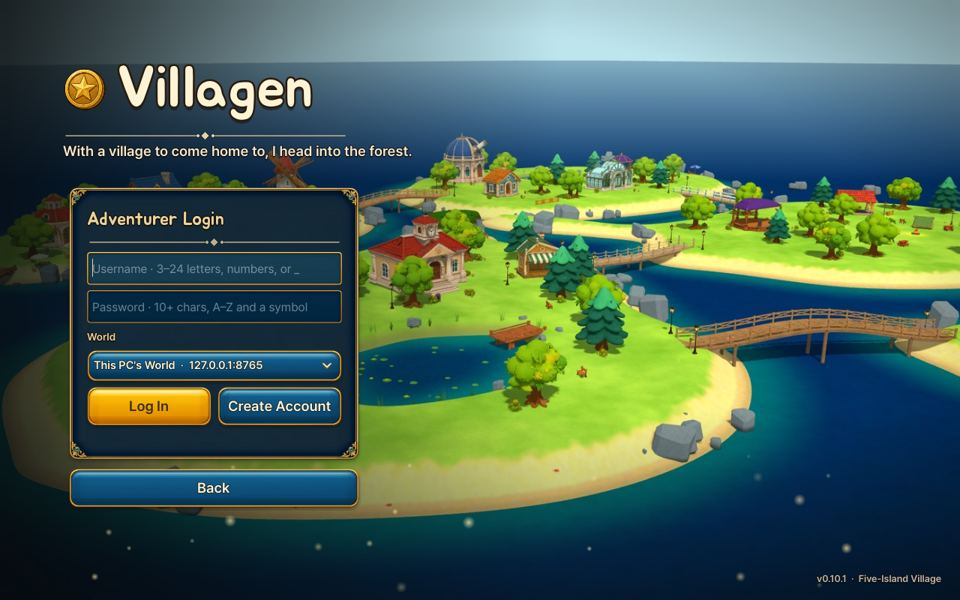
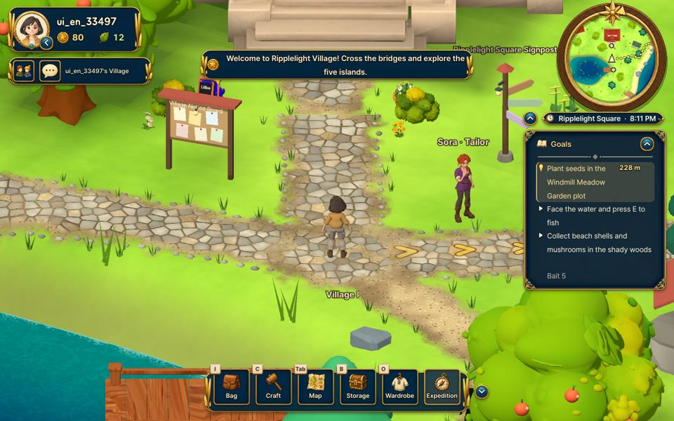
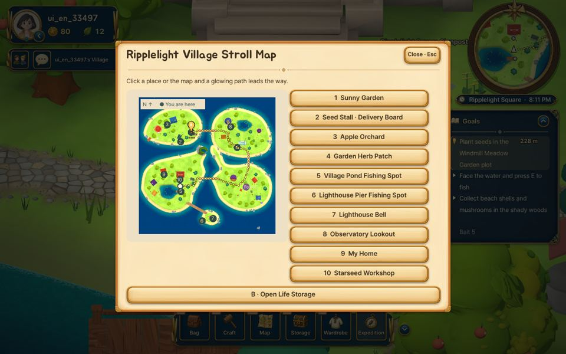
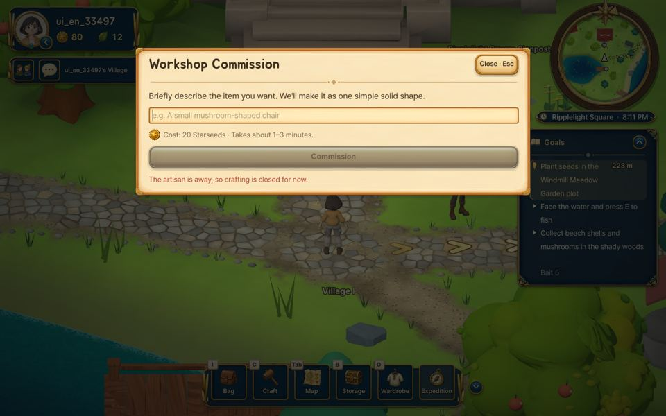
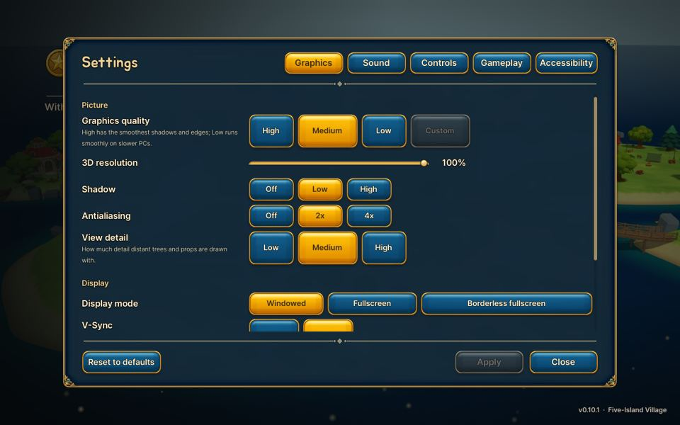

# Villagen Walkthrough (15-minute tour)

| 🌐 한국어 | 🌐 English | 🌐 中文 |
|:---:|:---:|:---:|
| [**워크스루 보기**](WALKTHROUGH_KO.md) | [**Walkthrough**](WALKTHROUGH_EN.md) | [**游戏攻略**](WALKTHROUGH_ZH.md) |
| [⬇ 게임 받기 (Windows)](https://github.com/NormalMan0228/tripo_s1/releases/latest/download/Villagen_Windows.zip) | [⬇ Download (Windows)](https://github.com/NormalMan0228/tripo_s1/releases/latest/download/Villagen_Windows.zip) | [⬇ 下载游戏 (Windows)](https://github.com/NormalMan0228/tripo_s1/releases/latest/download/Villagen_Windows.zip) |
| 설정 → 게임플레이 → 언어 → **한국어** | Settings → Gameplay → Language → **English** | 设置 → 游戏 → 语言 → **中文** |

> **Villagen** = village + generate. Live in a five-island village, and when you want something, **describe it in a sentence: the server designs it with AI (Gemini) and builds it in 3D with Tripo**, then you place it in your village.

**Download:** [Villagen_Windows.zip (always the latest)](https://github.com/NormalMan0228/tripo_s1/releases/latest/download/Villagen_Windows.zip) · Windows 10/11 · no installer

**Language:** one ZIP contains Korean, English and Chinese. The game starts in your Windows language; change it any time from **Settings** on the title screen, or **Esc → Settings → Gameplay → Language** in game.

---

## 0. Launch (1 min)
1. Unzip the download and run **`Villagen.exe`** in the `Villagen` folder.
2. If Windows shows "Windows protected your PC", click **More info → Run anyway**.
3. On the title screen, press **Start Game** to open the login screen.

## 1. Create an account (1 min)

- The world is already set to **Online World**. Leave it as it is.
- Enter a username and password, then press **Create Account**. No invitation code is needed.
  - Username: 3–24 letters, numbers or _
  - Password: 10+ characters, including an uppercase letter and a symbol
- New accounts start with trial **Starseeds**, the currency used for crafting.

## 2. From home to the village (1 min)
- You start inside **My Home**, where the home music plays.
- Walk out of the front door to enter the village.

## 3. Explore the village (3 min)

| Where | What |
|---|---|
| Top left | Profile, Starseeds, leaves, friends and chat |
| Top right | Minimap, place and time |
| Right | **Goals**. Click a line to turn on **route guidance**: arrows on the ground, a light pillar at the destination and the distance left |
| Bottom | Bag (I) · Craft (C) · Map (Tab) · Storage (B) · Wardrobe (O) · Expedition |

- **Move** WASD · **Run** Shift · **Interact** E · **Fold HUD** U · **Menu** Esc
- Hover over icon-only buttons to see their names.
- The village music switches between a **day track and a night track** with the time of day.

- In **Tab (Map)**, click a place and a glowing path leads you there: gardens, orchard, fishing spots, lighthouse, observatory, My Home, Starseed Workshop and more.

## 4. ★ Crafting: server → AI design → Tripo 3D (5 min)

1. In the village, press **C (Craft)**. At home or in the workshop, choose **Create**.
2. Describe what you want in a sentence, for example `a small mushroom-shaped chair` or `a mailbox with a blue ribbon`.
3. Press **Commission**. **Gemini** on the server draws the design and shows a quote.
4. Press **Confirm Craft** and **Tripo 3D** builds the model. This takes about 1–3 minutes, and you can keep exploring meanwhile.
5. The finished object goes into your bag. **Place** it anywhere, rotate it and **paint** it.

> Trial rules: 3 crafts per account. Each craft makes one static piece of furniture that you paint yourself.

## 5. Village life (2 min)
| Farming | Fishing | Foraging |
|---|---|---|
|  |  |  |
| Plant seeds in a garden plot with E and water them. They are ready to harvest after a while | Face the water and press E, then press E again when a fish bites | Pick up shells, mushrooms, herbs and branches with E. Grass, stone and wood each have their own gathering sounds |

Sell your harvest at the seed stall or deliver it to orders on the delivery board.

## 6. Expedition: survive seven nights (3 min)

1. Press **Expedition** at the bottom and choose a region and a difficulty. If this is your first time, pick **Stroll**.
   - Regions: **Pinebreeze Forest**, Sunset Quarry, **Frostlight Basin**
   - Each region has its own music, and a portal sound plays as you leave.
2. Stand near trees, stones and grass and press **E** to gather materials.
3. Craft tools and a campfire from them, and hold off the monsters that come at night until the seventh night.
4. Finish to earn Starseeds. Harder difficulties pay more.

## 7. Settings

In **Esc → Settings** you can change:
- Graphics quality (choose **Low** on slow PCs)
- Sound volumes (music, effects and ambience separately)
- Key bindings and accessibility
- **Language** (under the **Gameplay** tab)

---

### Troubleshooting
| Problem | Fix |
|---|---|
| Can't connect | Check your internet connection and Windows Firewall, then restart the game. |
| A "craft limit" message appears | You have used this account's trial crafts. |
| Choppy frame rate | Esc → Settings → Graphics quality → **Low**. |
