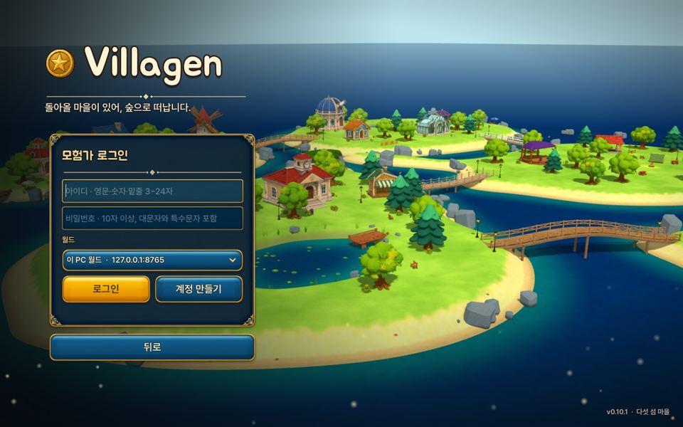
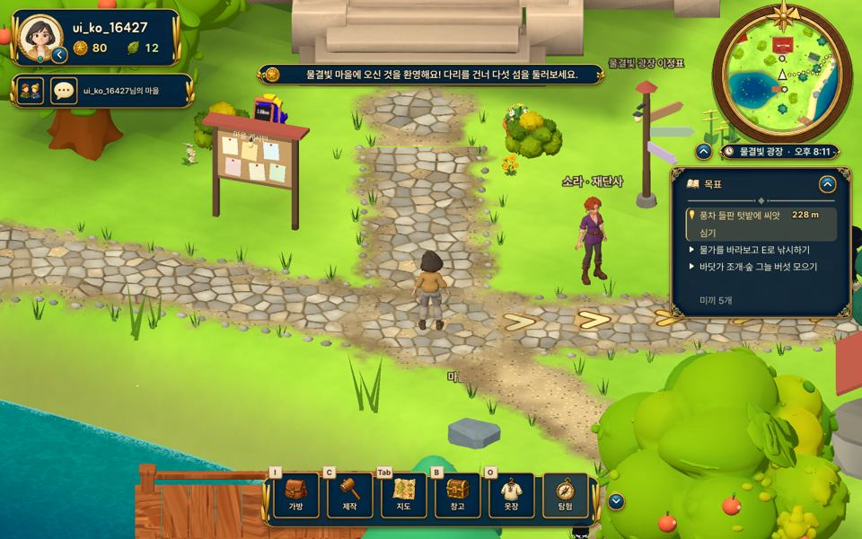
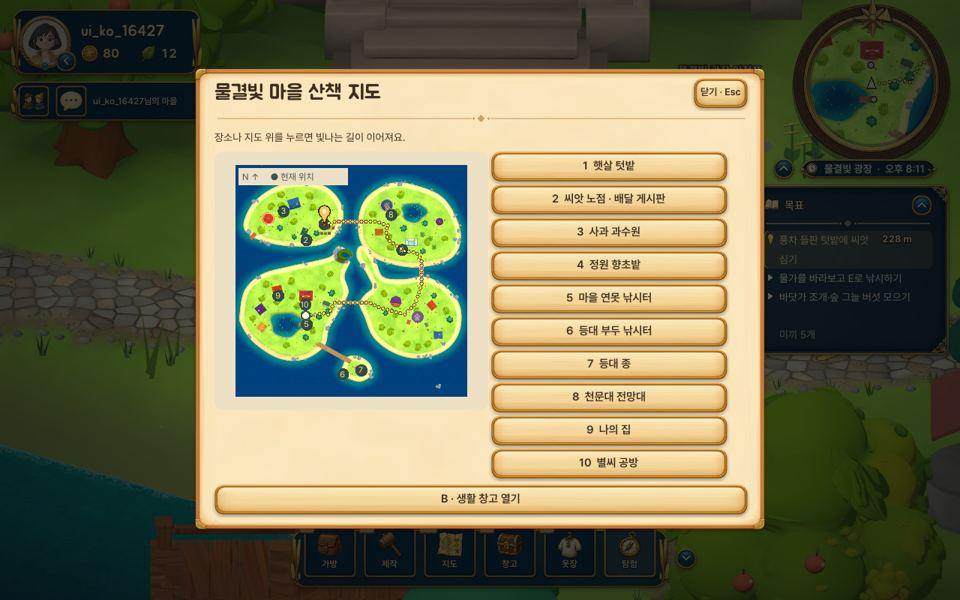
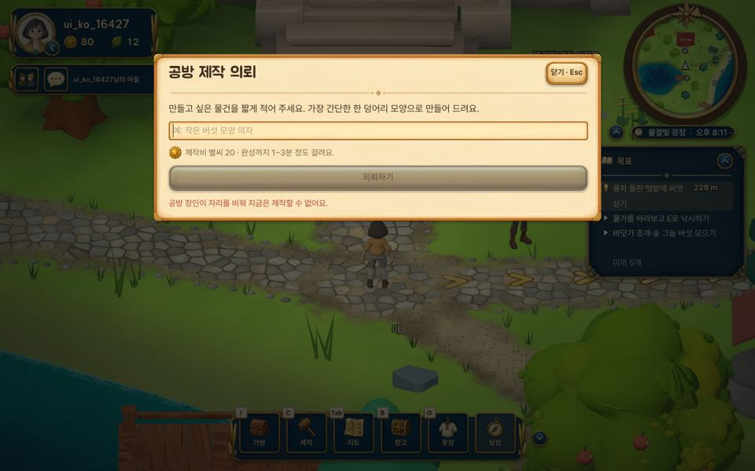
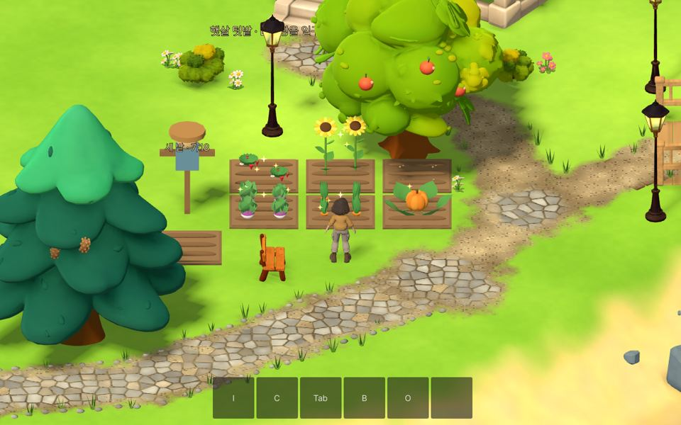
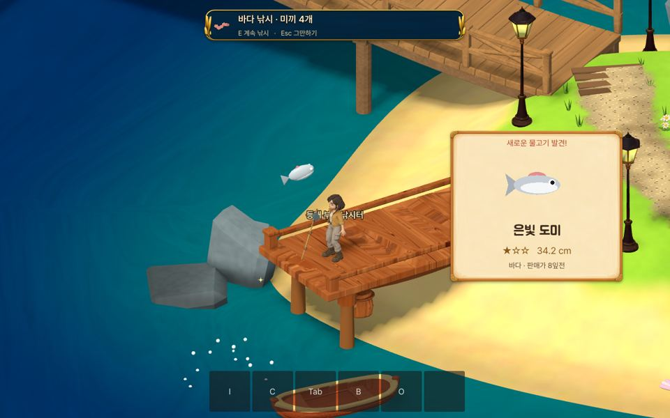
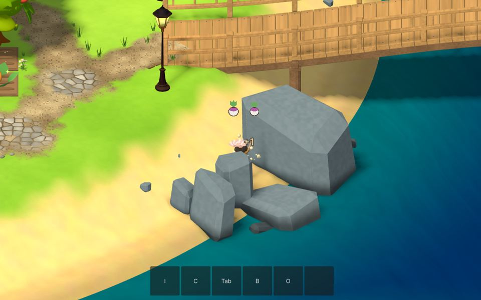
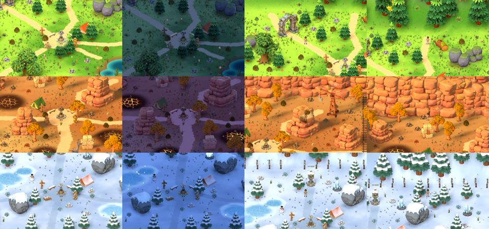
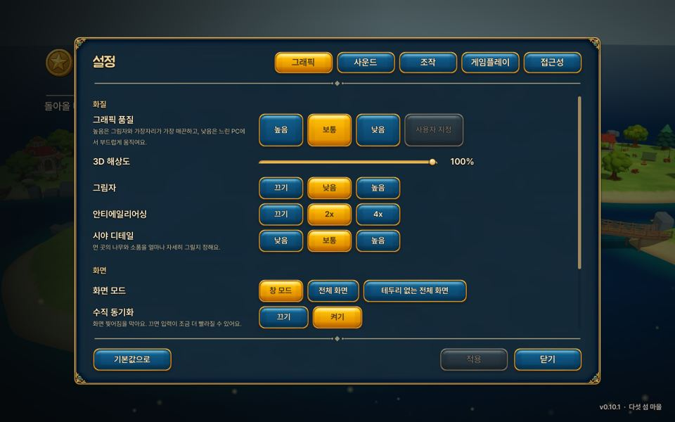

# Villagen 워크스루 (15분 체험 코스)

> **Villagen** = village + generate. 다섯 섬 마을에서 살면서, 원하는 물건을 **문장으로 의뢰하면 서버가 AI(Gemini)로 설계하고 Tripo 3D로 만들어** 마을에 놓을 수 있는 게임입니다.

**다운로드:** [Villagen_Windows.zip (항상 최신판)](https://github.com/NormalMan0228/tripo_s1/releases/latest/download/Villagen_Windows.zip) · Windows 10/11 · 설치 없음

---

## 0. 실행 (1분)
1. ZIP을 받아 압축을 풀고 `Villagen` 폴더의 **`Villagen.exe`**를 실행합니다.
2. Windows "PC 보호" 창이 뜨면 **추가 정보 → 실행**을 누릅니다.
3. 타이틀에서 **게임 시작**을 누르면 로그인 화면이 나옵니다.

## 1. 계정 만들기 (1분)

- 월드는 **온라인 월드**로 정해져 있습니다. 바꾸지 마세요.
- 아이디와 비밀번호를 입력하고 **계정 만들기**를 누릅니다. 초대 코드는 필요 없습니다.
  - 아이디: 영문·숫자·밑줄 3~24자
  - 비밀번호: 10자 이상, 대문자와 특수문자 포함
- 새 계정에는 체험용 **별씨**가 들어 있습니다. 별씨는 물건 제작에 씁니다.

## 2. 집에서 마을로 (1분)
- 처음에는 **나의 집** 안에서 시작합니다. 집 BGM이 나옵니다.
- 현관문으로 걸어 나가면 마을이 열립니다.

## 3. 마을 둘러보기 (3분)

| 화면 위치 | 내용 |
|---|---|
| 왼쪽 위 | 프로필, 별씨, 잎, 친구·채팅 |
| 오른쪽 위 | 미니맵, 장소와 시간 |
| 오른쪽 | **목표** 목록 — 한 줄을 누르면 **길 안내**가 켜집니다(바닥 화살표, 목적지 빛기둥, 남은 거리) |
| 아래 | 가방(I) · 제작(C) · 지도(Tab) · 창고(B) · 옷장(O) · 탐험 |

- **이동** WASD · **달리기** Shift · **상호작용** E · **HUD 접기** U · **메뉴** Esc
- 그림만 있는 버튼은 마우스를 올리면 이름이 보입니다.
- 마을 음악은 **낮 곡과 밤 곡**이 시간에 따라 바뀝니다.

- **Tab(지도)**에서 장소를 누르면 빛나는 길이 그 장소까지 이어집니다. (텃밭, 과수원, 낚시터, 등대, 천문대, 나의 집, 별씨 공방 …)

## 4. ★ 물건 제작: 서버 → AI 설계 → Tripo 3D (5분)

1. 마을에서 **C(제작)**를 누릅니다. 집이나 공방에서는 **[만들기]**를 누릅니다.
2. 만들고 싶은 물건을 문장으로 적습니다. 예: `작은 버섯 모양 의자`, `파란 리본이 달린 우체통`
3. **의뢰하기**를 누르면 서버의 **Gemini가 설계도**를 그리고 견적을 보여 줍니다.
4. **제작 확정**을 누르면 **Tripo 3D**가 모델을 만듭니다. 1~3분쯤 걸리고, 그동안 마을을 돌아다녀도 됩니다.
5. 완성된 물건은 가방에 들어옵니다. 원하는 곳에 **놓고**, 돌리고, **색칠**할 수 있습니다.

> 체험판 규칙: 계정당 3회 제작할 수 있고, 만들어지는 것은 직접 색칠하는 정적인 가구 한 덩어리입니다.

## 5. 마을 생활 (2분)
| 농사 | 낚시 | 채집 |
|---|---|---|
|  |  |  |
| 텃밭에서 E로 씨앗을 심고 물을 주면, 시간이 지나 수확할 수 있습니다 | 물을 바라보고 E를 누르고, 입질이 오면 다시 E를 누릅니다 | 조개·버섯·약초·나뭇가지를 E로 줍습니다(풀·돌·나무 채집 소리) |

수확물은 씨앗 노점에서 팔거나 배달 게시판 주문에 냅니다.

## 6. 탐험: 일곱 밤 생존 (3분)

1. 아래 **탐험** 버튼을 누르고 지역과 난이도를 고릅니다. 처음이라면 **산책** 난이도를 고르세요.
   - 지역: **솔바람 숲**, 노을 채석장, **서리빛 분지**
   - 지역마다 배경음악이 다르고, 출발할 때 포탈 소리가 납니다.
2. 나무·돌·풀 가까이에서 **E**를 누르면 재료를 모읍니다.
3. 재료로 도구와 모닥불을 만들고, 밤에 오는 몬스터를 막아 내며 일곱 밤을 버팁니다.
4. 완주하면 별씨를 받습니다. 어려운 난이도일수록 더 많이 받습니다.

## 7. 설정

**Esc → 설정**에서 다음을 바꿀 수 있습니다.
- 그래픽 품질(느린 PC는 **낮음**)
- 소리 크기(음악·효과음·환경음 따로)
- 키 배치, 접근성

---

### 문제가 생기면
| 증상 | 해결 |
|---|---|
| 접속이 안 됨 | 인터넷 연결과 Windows 방화벽을 확인하고 다시 실행합니다. |
| "제작 한도" 안내가 뜸 | 체험판의 계정당 제작 횟수를 다 쓴 것입니다. |
| 화면이 끊김 | Esc → 설정 → 그래픽 품질을 **낮음**으로 바꿉니다. |
