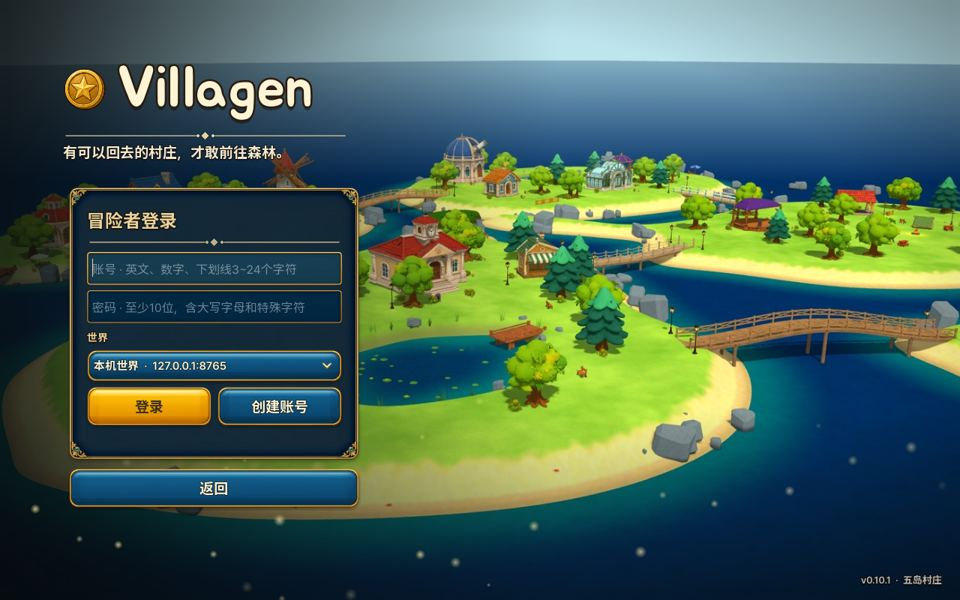
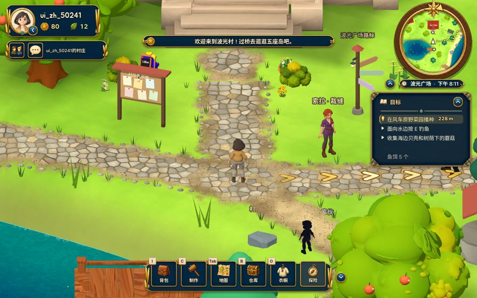
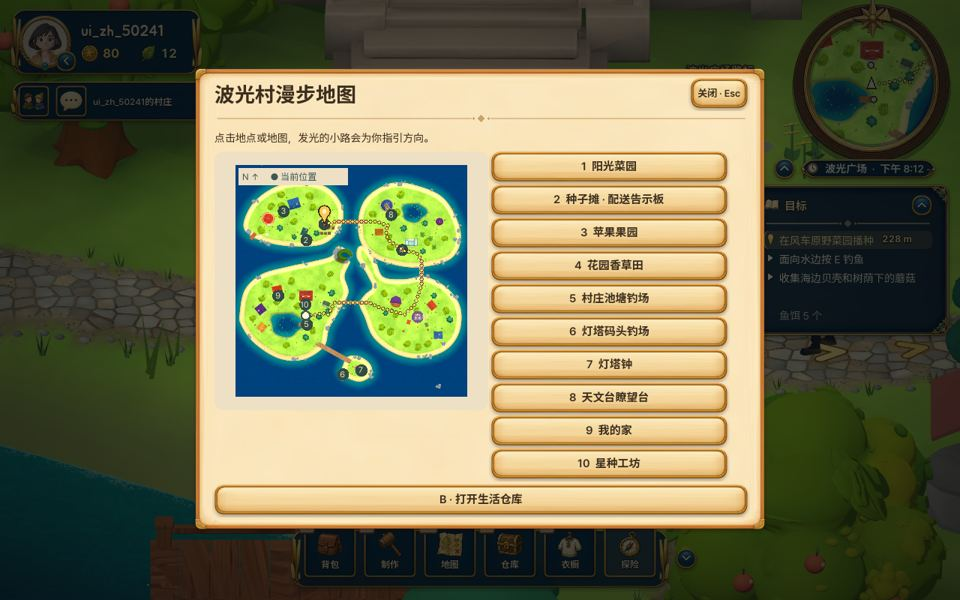
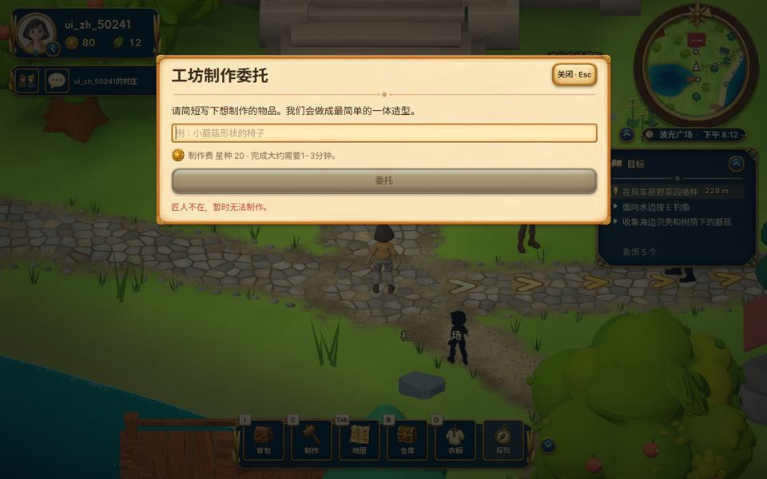
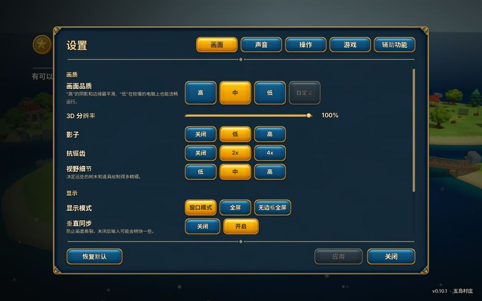

# Villagen 游戏攻略（15 分钟体验）

| 🌐 한국어 | 🌐 English | 🌐 中文 |
|:---:|:---:|:---:|
| [**워크스루 보기**](WALKTHROUGH_KO.md) | [**Walkthrough**](WALKTHROUGH_EN.md) | [**游戏攻略**](WALKTHROUGH_ZH.md) |
| [⬇ 게임 받기 (Windows)](https://github.com/NormalMan0228/tripo_s1/releases/latest/download/Villagen_Windows.zip) | [⬇ Download (Windows)](https://github.com/NormalMan0228/tripo_s1/releases/latest/download/Villagen_Windows.zip) | [⬇ 下载游戏 (Windows)](https://github.com/NormalMan0228/tripo_s1/releases/latest/download/Villagen_Windows.zip) |
| 설정 → 게임플레이 → 언어 → **한국어** | Settings → Gameplay → Language → **English** | 设置 → 游戏 → 语言 → **中文** |

> **Villagen** = village + generate。在五座岛屿组成的村庄里生活。想要什么物品，**用一句话描述，服务器就会用 AI（Gemini）设计，再用 Tripo 3D 生成模型**，然后放进你的村庄。

**下载：** [Villagen_Windows.zip（始终为最新版）](https://github.com/NormalMan0228/tripo_s1/releases/latest/download/Villagen_Windows.zip) · Windows 10/11 · 免安装

**语言：** 一个 ZIP 同时包含韩语、英语和中文。游戏首次启动时跟随 Windows 语言，之后可随时在标题画面的 **设置**，或游戏中 **Esc → 设置 → 游戏 → 语言** 里切换。

---

## 0. 启动（1 分钟）
1. 解压下载的文件，运行 `Villagen` 文件夹中的 **`Villagen.exe`**。
2. 如果出现"Windows 已保护你的电脑"，点击 **更多信息 → 仍要运行**。
3. 在标题画面点击 **开始游戏**，进入登录画面。

## 1. 创建账号（1 分钟）

- 世界已默认设为 **在线世界**，无需更改。
- 输入账号和密码，点击 **创建账号**。不需要邀请码。
  - 账号：英文、数字、下划线，3~24 个字符
  - 密码：至少 10 位，需包含大写字母和特殊字符
- 新账号自带体验用的 **星种**。星种用于制作物品。

## 2. 从家里走进村庄（1 分钟）
- 一开始你在 **我的家** 里，播放的是家里的背景音乐。
- 从大门走出去，就进入村庄。

## 3. 逛逛波光村（3 分钟）

| 位置 | 内容 |
|---|---|
| 左上 | 头像、星种、叶子、好友和聊天 |
| 右上 | 小地图、地点和时间 |
| 右侧 | **目标**。点击其中一行即可开启 **路线引导**：地面箭头、目的地光柱、剩余距离 |
| 下方 | 背包（I）· 制作（C）· 地图（Tab）· 仓库（B）· 衣橱（O）· 探险 |

- **移动** WASD · **奔跑** Shift · **互动** E · **折叠界面** U · **菜单** Esc
- 只有图标的按钮，把鼠标移上去就会显示名称。
- 村庄音乐会随时间在 **白天曲和夜晚曲** 之间切换。

- 在 **Tab（地图）** 中点击地点，就会出现一条通往那里的发光道路：菜园、果园、钓场、灯塔、天文台、我的家、星种工坊等。

## 4. ★ 制作物品：服务器 → AI 设计 → Tripo 3D（5 分钟）

1. 在村庄里按 **C（制作）**。在家里或工坊里则点击 **制作**。
2. 用一句话描述想要的物品，例如 `小蘑菇形状的椅子`、`系着蓝色丝带的邮筒`。
3. 点击 **委托**。服务器上的 **Gemini** 会画出设计图，并给出报价。
4. 点击 **确认制作**，**Tripo 3D** 就会开始生成模型。大约需要 1~3 分钟，期间可以继续在村庄里走动。
5. 完成的物品会放进背包。可以 **摆放** 到任意位置、旋转，还能 **上色**。

> 体验版规则：每个账号可制作 3 次。每次制作的是一件需要自己上色的静态家具。

## 5. 村庄生活（2 分钟）
| 种田 | 钓鱼 | 采集 |
|---|---|---|
|  |  |  |
| 在菜园按 E 播种、浇水，过一段时间就能收获 | 面向水边按 E 抛竿，鱼咬钩时再按 E | 按 E 捡贝壳、蘑菇、草药和树枝。采草、采石、砍树各有不同的音效 |

收获的作物可以卖给种子摊，或交给配送告示板上的订单。

## 6. 探险：生存七夜（3 分钟）

1. 点击下方的 **探险**，选择地区和难度。第一次玩建议选 **漫步**。
   - 地区：**松风森林**、晚霞采石场、**霜光盆地**
   - 每个地区都有自己的背景音乐，出发时会响起传送门音效。
2. 靠近树木、石头、草丛按 **E** 收集材料。
3. 用材料制作工具和篝火，抵挡夜里来袭的怪物，坚持到第七夜。
4. 完成后可获得星种。难度越高，奖励越多。

## 7. 设置

在 **Esc → 设置** 中可以调整：
- 画面品质（电脑较慢时选 **低**）
- 音量（音乐、音效、环境音分开调节）
- 按键和辅助功能
- **语言**（在 **游戏** 标签页中）

---

### 常见问题
| 现象 | 解决方法 |
|---|---|
| 无法连接 | 检查网络连接和 Windows 防火墙，然后重新启动游戏。 |
| 出现"制作次数已用完"的提示 | 该账号的体验制作次数已经用完。 |
| 画面卡顿 | Esc → 设置 → 画面品质 → **低**。 |
